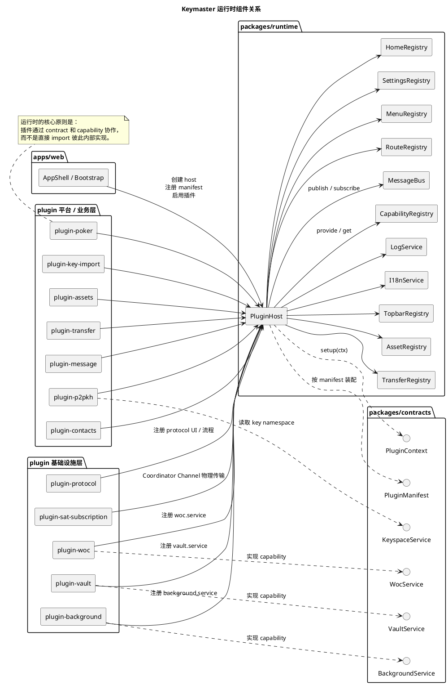
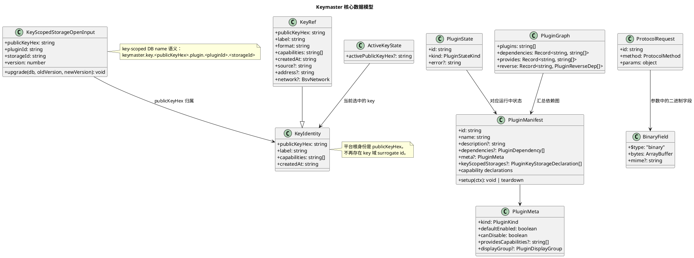
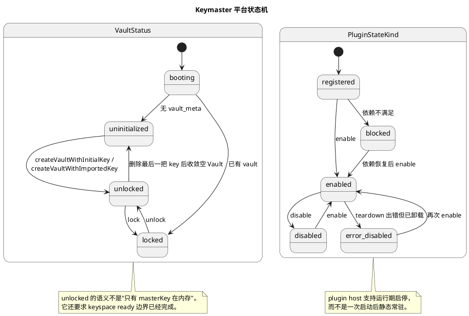
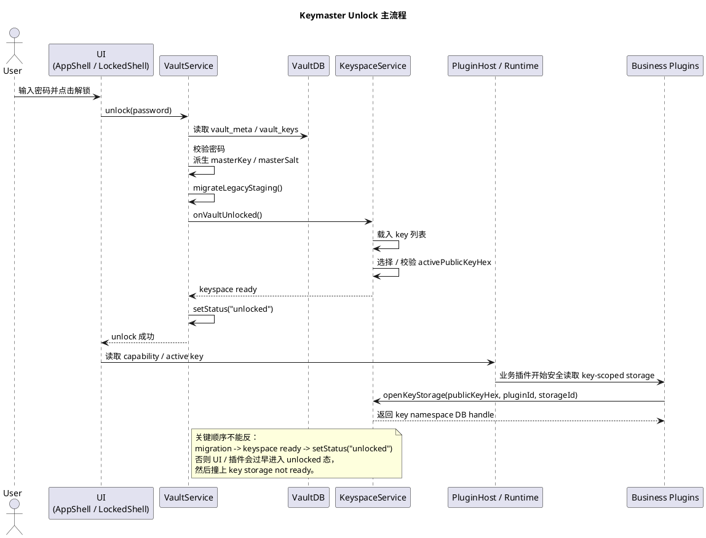

# 代码架构模型

这份文档描述的是代码内部的稳定逻辑结构，不是目录树。

这里重点回答四个问题：

- 运行时对象如何协作。
- 核心数据对象如何分层。
- 平台状态如何推进。
- 一条关键主流程如何穿过 Vault、Keyspace、Runtime 和业务插件。

设计取舍：

- 不展开具体页面和 `src/` 文件级实现，因为那是易变表象。
- 不把 `plugin-p2pkh`、`plugin-protocol`、`plugin-message` 的专题细节塞进总览页，避免图失焦。
- 只保留平台级稳定骨架，方便以后继续补专题文档。

`docu.md` 可以直接打开本文件，并渲染下面的 PlantUML 图。

## 1. 运行时组件关系

这张图表达运行时的装配骨架。

- `apps/web` 负责启动和装配。
- `runtime` 是插件宿主，不持有业务实现。
- `contracts` 只定义协议与能力接口，不放实现。
- `plugin-*` 通过 capability、registry、message bus 接入系统。



## 2. 核心数据模型

这张图只画平台级稳定对象，不画页面 view model。

关键理解：

- `PluginManifest` 是插件装配真值。
- `KeyIdentity` / `KeyRef` / `ActiveKeyState` 是平台 key 域真值。
- `KeyScopedStorageOpenInput` 表达业务数据归属到哪个 key namespace。



## 3. 平台状态机

这部分只画两个最关键的状态机：

- Vault 生命周期
- 插件生命周期

原因很直接：这是平台能否继续运行的两个总开关。



## 4. 关键执行流：Unlock

我选 `unlock` 作为总览页唯一主流程。

原因：

- 这条路径会穿过 Vault、Keyspace、Runtime 和业务插件。
- 它能体现这个系统最核心的边界收敛点。
- 它比某一个业务方法更能代表平台骨架。



## 5. 启动关键能力契约

> 状态：实现中。浏览器迁移、跨标签、localStorage 禁用和 setup 故障场景仍需在目标
> 浏览器 profile 中完成发布前验收。

插件 manifest 的 `meta.startup` 显式区分运行期不可关闭与首屏启动前提。只有
`startup: "required"` 的受信任内建插件才可成为 entrypoint 的启动依赖，并必须同时
满足 `defaultEnabled: true`、`canDisable: false` 和非空 capability 声明；Vault 当前
是唯一 required 插件。

启停配置存储为 `{ version: 2, enabled }`。旧裸对象只迁移一次，required 插件的值
始终由 manifest 优先规范化为 `true`，包括 storage 跨标签同步。runtime host 在
`register` / `enable` 阶段校验 manifest、setup ownership 和声明 capability；required
失败抛出结构化启动错误并回滚，optional 失败仍隔离为 `error-disabled`。

required 插件的依赖 provider 必须在完整 manifest 图上验证，而不是依赖当前注册顺序；
因此 Web bootstrap 会先预扫描全部 manifest，再开始逐个注册。

Web 的边界是：

```text
manifest 注册 -> host.assertCapabilities(WEB_STARTUP_REQUIRED_CAPABILITIES)
              -> 成功后 root.render(React)
              -> 缺失/失败进入 pre-bootstrap.plugins fatal page
```

React 组件不再负责推断或兜底启动依赖。

## 6. 阅读方式

- 先看“运行时组件关系”，理解系统为什么是插件宿主架构。
- 再看“核心数据模型”，理解系统以什么对象作为真值。
- 再看“平台状态机”，理解什么时候系统能安全工作。
- 最后看“Unlock 主流程”，理解这些对象和状态是如何串起来的。

## 7. 后续可拆分的专题

这份文档故意没有继续展开以下专题：

- `plugin-protocol` 的 request / confirm / result 流程
- `plugin-p2pkh` 的转账预览与协议 spend 细节
- `plugin-message` 的本地消息历史与固定私密协议
- `plugin-contacts` 的 Ping/Pong 在线状态资源

普通 BSV/P2PKH 的确认数据链路已统一为：

```text
Coordinator P2PKH data-source selection
  -> p2pkh.transactions-sync（按网络过滤、可断点续传）
  -> p2pkh_transactions（唯一确认事实）
  -> p2pkh_owned_outpoints（可重建查询投影）
  -> P2PKH service 的余额、Coins、Transactions 视图
```

页面不直接访问 WOC/JungleBus。Coordinator 持有 provider 选择、配置和
`includeTestnet` 的 worker 侧真值；配置先持久化再切换内存状态。广播成功后
由本地交易 DAG 提供 `local-confirmed` 找零，异常交易保持 `isolated`，链事实
在确认、竞争花费或完整 reorg 核对后再收敛本地覆盖层。

如果后面要继续写，我建议每个专题单独一页，不要继续往这份总览里堆。
