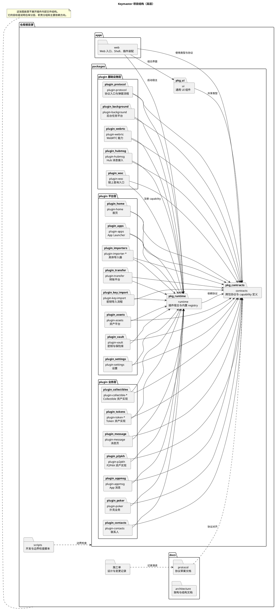

# 项目结构

这个文档只表达仓库的高层稳定结构，不展开各包内部的 `src/` 细节。

这样做的原因有两个：

- 完整目录树变化太快，图很容易过时。
- 这个仓库的核心是分层和插件边界，不是文件清单。

`docu.md` 可以直接打开本文件并渲染下面的 PlantUML 代码块。

## 高层结构图

## 说明

- `apps/web` 是最终装配层，负责把 runtime、UI 和插件装进浏览器应用。
- `packages/contracts` 是跨包协议层，尽量让插件通过 contract 协作，而不是互相直连实现。
- `packages/runtime` 是插件宿主，负责 registry、capability、路由和运行时装配。
- `packages/ui` 是共享 UI 组件层。
- `packages/plugin-*` 按“基础设施 / 平台 / 业务”三组整理，目的是先稳住边界，再承载具体功能。
- `docs/protocol` 放协议草案，`docs/architecture` 放结构和架构文档，避免混放。
