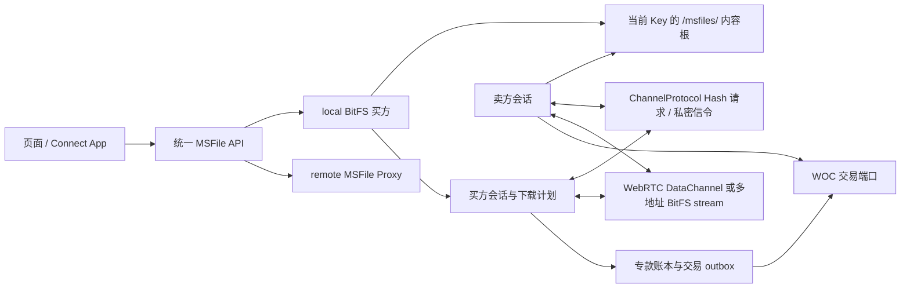

# BitFS 文件买卖

本文说明 Keymaster 当前代码中的 BitFS 文件购买与销售流程。内容以 `packages/plugin-msfile/src/bitfs/`、`apps/web/src/keymasterSessionCoordinator.worker.ts` 和 `packages/plugin-window-p2p/` 的实际实现为准，不把需求稿、施工记录或未接线的 SDK 类型当作已经运行的功能。

## 一句话模型

Keymaster 把 BitFS 买方和卖方都放在 Coordinator SharedWorker 中运行：Window 只承载浏览器网络能力，Vault 只提供受限签名，真正的会话、账本、交易原文和恢复状态由 Worker 持久化。

## 阅读顺序

| 文档 | 解决的问题 |
| --- | --- |
| [业务与流程](./业务与流程.md) | 谁发起需求、谁报价、连接如何建立、内容如何交付 |
| [资金与账本](./资金与账本.md) | 普通余额如何变成专款、费用池如何记账和回收 |
| [交易与广播](./交易与广播.md) | Kind 1–13、outbox、WOC 广播和 txid 对账 |
| [签名与证据](./签名与证据.md) | Vault 签名、exact bytes、journal 和内容校验 |
| [存储布局与生命周期](./存储布局与生命周期.md) | 长期文件、临时工作区、内容格式、用途和清理规则 |
| [状态与恢复](./状态与恢复.md) | 买方/卖方状态机、崩溃恢复、重连、取消和退款 |

## 先记住的五个边界

1. **local 不伪装成 remote。** local 读取绑定当前 Key 的 OwnerFileStore 根 `<owner>/msfiles/`；页面入口是 `/msfile/storage`，但这不是物理文件路径。local 不编码 `/msfile/1.0.0`，也不伪造供应商公钥；remote MSFile 仍走原有 libp2p 协议。
2. **SDP 和 multiaddr 是两种不同的连接方式。** `webrtc-sdp` 通过 `bsv8.hash.request.v1` 与 `bsv8.webrtc.signal.v1` 建立 DataChannel；它不是 WebRTC Direct multiaddr，也不会被改写成该地址。
3. **池内 Kind 7 是双方本地递进的付款状态。** 买方验货后保存 Kind 5/7，卖方补签并保存双签交易；当前正常路径不把每一轮 Kind 7 交易提交给 WOC。
4. **开池和关池的广播者不同。** 买方在验证 Kind 3 后广播 FundingTx；卖方收到 Kind 12 后广播完整关池交易。买方收到 Kind 13 后只验证、保存并按相同 txid 对账。
5. **`confirmed` 不等于已经出块。** 代码把 WOC 接受交易或按 txid 观察到交易视为确定成功；它不等待区块确认。到期退款等需要成熟条件的操作会另外读取链高度。

## 当前实现范围

| 能力 | 当前代码状态 | 主要代码 |
| --- | --- | --- |
| local / remote 来源路由 | 已接线 | `packages/plugin-msfile/src/storage/`、`packages/contracts/src/msfile.ts` |
| Hash 需求发现与报价 | 已接线 | `sellerRuntime.ts`、`buyerTask.ts` |
| `webrtc-sdp` offer / answer / ICE | 已接线 | `webrtcStreamRuntime.ts`、`msfileLane.ts`、Coordinator Worker |
| 买方开池、交付、付款、关池 | 已接线 | `buyerProtocol.ts`、`buyerTask.ts` |
| 卖方报价、交付、收款、关池 | 已接线 | `sellerProtocol.ts`、`sellerSession.ts` |
| 多卖家共享 Seed、独占 Block 分配 | 已接线 | `buyerDownloadPlan.ts` |
| 专款拆分 / Funding / close / refund outbox 与 txid 对账 | 已接线 | `broadcast.ts`、`wocChain.ts`、`funding.ts` |
| Kind 8–11 仲裁与取回 | 类型、schema 和 SDK 格式存在；当前业务路由未接线 | `sessionJournal.ts`、`sellerProtocol.ts`、`buyerProtocol.ts` |
| 真实浏览器和生产网络验收 | 不由本文推断；以[覆盖矩阵](../集成测试/覆盖矩阵.md)为准 | `e2e/integration/journeys/bitfs/` |

当前已知边界：Native Range 音视频播放器仍要求 remote supplier 公钥；`local-bitfs` 的 Seed/Block 读取和购买入库可用，但 local 媒体播放映射尚未接通。

## 术语

| 术语 | 含义 |
| --- | --- |
| Seed | 按顺序排列的 32 字节 Block 摘要序列；`seedHashHex` 是 Seed 字节本身的 SHA-256，文件大小和文件名由报价与 `meta` 另外绑定 |
| Block | 文件的一块内容；标准块上限为 256 KiB，按内容 SHA-256 校验 |
| 报价 Kind 1 | 卖方签名、绑定买方、Seed、文件信息和价格的协议 Artifact |
| 费用池 | 买方为一个卖方会话建立的固定预算和付款状态；一个文件可以有多个卖方池 |
| 池内付款状态 | Kind 5/7 验证和双方签名形成的累计状态；不表示每轮都已广播 |
| WOC | Coordinator 使用的链服务；只接收已签名 raw transaction，并返回 txid 事实 |
| exact bytes | 首次保存后不能被另一份字节覆盖的原始 Artifact 或交易原文 |
| generation / owner epoch | 用来拒绝锁定、切 Key、切存储或旧 Worker 的迟到结果 |

## 代码入口

- 买方协议状态机：`packages/plugin-msfile/src/bitfs/buyerProtocol.ts:524-1163`
- 买方任务、资金准备和退款：`packages/plugin-msfile/src/bitfs/buyerTask.ts:270-977`
- 卖方协议状态机：`packages/plugin-msfile/src/bitfs/sellerProtocol.ts:131-385`
- 会话和 exact evidence：`packages/plugin-msfile/src/bitfs/sessionJournal.ts:157-245`
- 专款账本：`packages/plugin-msfile/src/bitfs/funding.ts:23-240`、`packages/plugin-msfile/src/bitfs/funding.ts:242-305`
- 交易 outbox 和广播器：`packages/plugin-msfile/src/bitfs/broadcast.ts:17-253`
- WebRTC stream runtime：`packages/plugin-msfile/src/bitfs/webrtcStreamRuntime.ts:121-802`
- Channel 需求和信令接入：`apps/web/src/keymasterSessionCoordinator.worker.ts:10930-11693`
- 需求匹配和报价：`packages/plugin-msfile/src/bitfs/sellerRuntime.ts:47-129`
- 存储布局与生命周期：[存储布局与生命周期](./存储布局与生命周期.md)

## 文档维护口径

- 稳定行为写入本目录；一次性施工步骤和命令输出留在 Git 历史或集成测试目录。
- 每个结论都应能回到上述代码入口；代码行号变化时，以符号名为主要定位方式。
- “已接线”只表示执行路径存在，不表示真实浏览器、网络或生产环境已经验收。
- 需求稿与施工单仍可能描述未完成目标；与本文冲突时，以本文记录的代码行为和明确的“未接线”标记为准。
