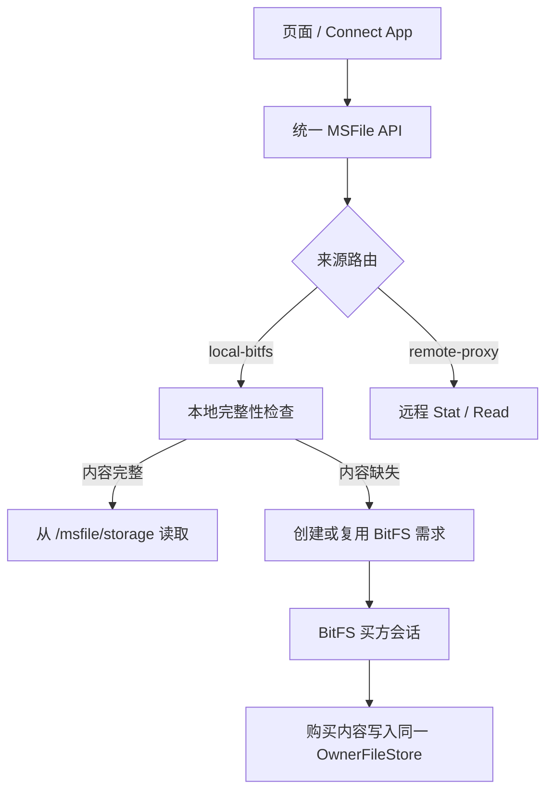
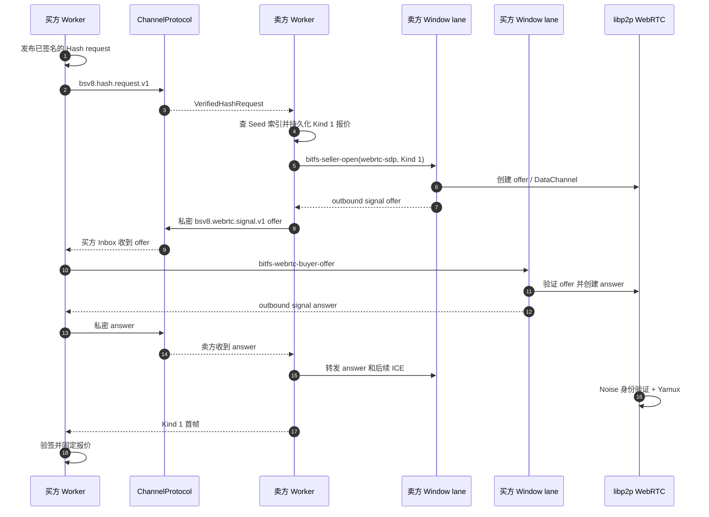
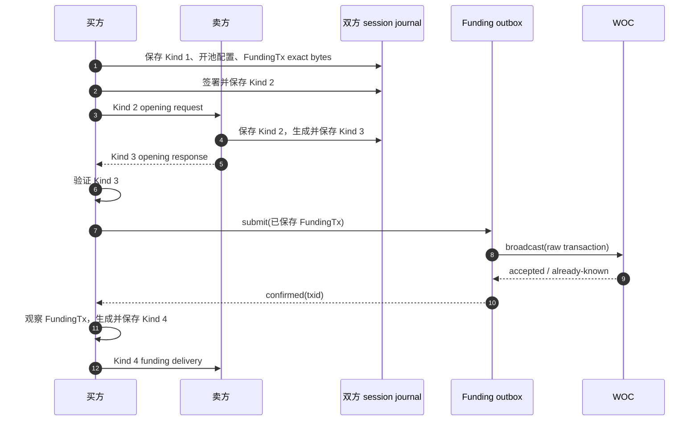
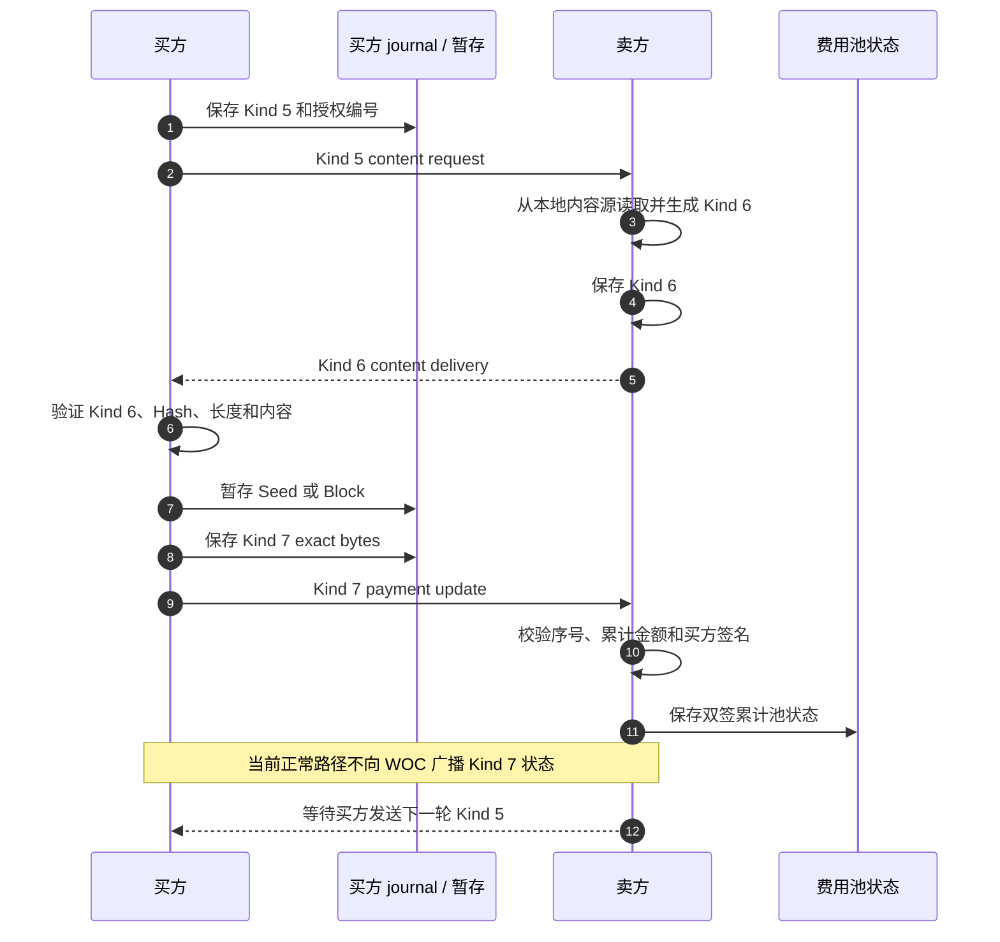
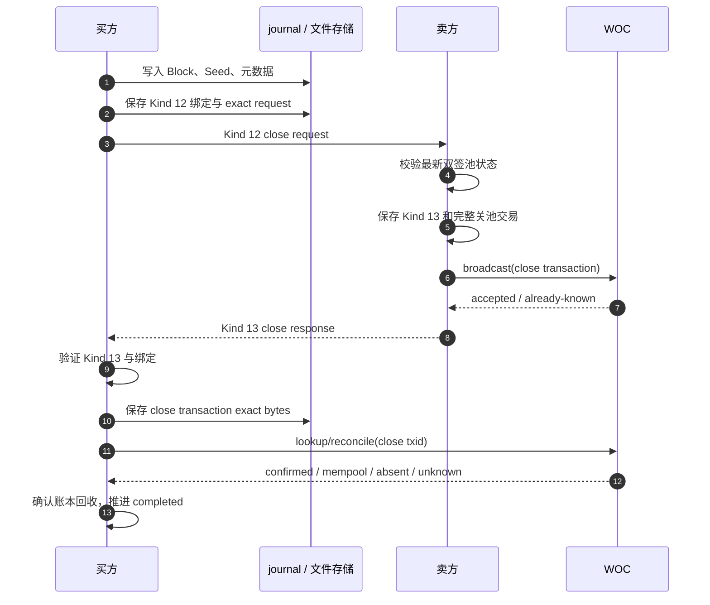
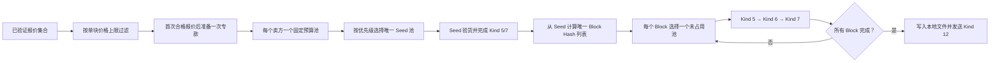

# 业务与流程

## 1. 统一 MSFile 入口

页面、可信插件和 Connect App 看到的是同一组 MSFile 能力。Coordinator 根据 `sourceId` 和 `sourceKind` 选择来源：

- `local-bitfs`：直接读取当前 Key 的 OwnerFileStore；内容不存在时可以发起 BitFS 购买。
- `remote-proxy`：继续使用远程 MSFile Proxy 和原有 `/msfile/1.0.0` 协议。
- local 不创建虚假 libp2p connection，不生成 MSFile request ID，也不把本地内容编码成远程 wire frame。

local Stat 只有在元数据、Seed Hash、文件大小、Block 数量和所有 Block 存在性都通过后才报告 `available`。购买完成的内容按 Block → Seed → 元数据提交，提交后才成为可读取的本地文件。

代码入口：`packages/plugin-msfile/src/storage/`、`packages/contracts/src/msfile.ts`、`packages/plugin-msfile/src/bitfs/buyerProtocol.ts:1250-1267`。

## 2. 需求发现和连接建立

当前 `webrtc-sdp` 路径是“买方发布需求，卖方主动发起连接”：

1. 买方 Worker 发布 `bsv8.hash.request.v1`，其中包含 Seed Hash、买方公钥、过期时间和 `webrtc-sdp` locator。
2. 卖方 Worker 收到已验签的 `VerifiedHashRequest`，只在 Seed 索引命中且 locator 合法时匹配。
3. 卖方先生成并持久化已签名的 Kind 1 报价，再通过 Window lane 建立 WebRTC offer。
4. 买方只接受引用自己有效 Hash 请求的 offer，核对 request、session、peer 和 owner epoch 后回答。
5. answer 和 ICE candidate 继续通过私密 Channel 信令转发；身份验证完成后建立标准 libp2p WebRTC 连接和 `/bitfs/wire/1.0.0` stream。
6. 卖方把已保存的 Kind 1 作为首帧发送，买方验证后才进入购买协议。

`webrtc-sdp` 是一条独立 transport。`sellerRuntime` 还支持经过白名单验证的 multiaddr locator，但不会把 SDP locator 改写成 `/webrtc-direct`；两条路径都最终承载同一 BitFS wire。相关代码：`sellerRuntime.ts:52-128`、`msfileLane.ts:120-179`、`webrtcStreamRuntime.ts:151-223`。

在 SDP 路径中，Window 只转发外部信令，数据面由标准 libp2p WebRTC interconnect 建立，协议 ID 为 `/bitfs/wire/1.0.0`，并使用 Noise 与 Yamux。当前 Keymaster 的 SDP 路径不配置 TURN、Circuit Relay 或 WebSocket fallback；STUN 配置通过 Window interconnect 注入。身份由已验证公钥派生并固定，入站 Artifact 还受帧大小、连接数、待处理 stream 和发送队列上限约束。相关代码：`packages/plugin-window-p2p/src/webrtcInterconnect.ts:20-87`、`packages/plugin-msfile/src/bitfs/webrtcStreamRuntime.ts:12-16,121-145`。

## 3. 买方购买流程

### 3.1 开池

买方接受报价后，先准备固定的开池配置、FundingTx 和 Kind 2 签名证据。FundingTx 在 Kind 3 到达并通过验证之前只进入本地 outbox，不广播。

FundingTx 的 canonical txid、输入、输出、找零和池编号必须同时与专款账本计划一致。广播结果未知时保留 `funding-unknown`，只按原 txid 查询，不重新生成交易。代码入口：`buyerTask.ts:423-503`、`buyerTask.ts:596-675`。

### 3.2 交付和池内付款

开池后，每一轮只处理一个 Seed 或一个 Block。买方先验证卖方交付，再保存买方付款签名；因此未经验证的内容不会触发 Kind 7。

同一费用池严格串行：下一轮 `paymentSequence` 必须比本地上一轮加一，累计卖方金额不能倒退。不同卖方的费用池可以各自串行推进，但共享同一个文件的 Seed 和 Block 调度计划。

### 3.3 入库和关池

所有唯一 Block 都完成验货和本地 Kind 5/7 付款后，买方先把文件提交到 `/msfile/storage`，再构造最终 Kind 12。最终请求绑定最新的授权编号、序号和累计金额。

卖方广播最终交易；买方不会为了同一笔关池交易再次构造或提交另一份交易。买方在 WOC 查询结果未知时保留 `close-unknown` 和池资金保护。

## 4. 多卖家共享计划

一个 Seed 只允许一个卖家池取得 Seed 付款归属；Block Hash 在整个文件计划中只能被一个池认领。调度优先级由用户选择为价格优先或最近速度优先。

`buyerDownloadPlan.ts` 使用 CAS 修订号和每 Seed 锁保存计划：`registerPool` 固定池预算，`activatePool` 等待 FundingTx 观察，`claimSeed` 选择唯一 Seed，`claimNextBlock` 保证 Block 独占，`completeSeed/completeBlock` 记录本地已验收付款，`closePool` 释放未完成认领。代码入口：`buyerDownloadPlan.ts:118-351`。

## 5. 卖方处理

卖方启用并完成索引后才会匹配需求。索引是从 `/msfile/storage` 派生的内存视图，只保留 Seed 元数据摘要，不保存内容副本；锁定、切 Key 或运行单元停止时清空。

收到 Kind 2、4、5、7、12 时，卖方按 `sellerSession` 的单会话串行队列处理，并先保存 exact 证据再发送响应。已存在的重复 Kind 2、Kind 5、Kind 7 和 Kind 12 会复用第一次保存的响应或交易，不生成第二条路径。代码入口：`sellerRuntime.ts:47-129`、`sellerProtocol.ts:131-345`、`sellerSession.ts:212-277`。

## 6. 连接错误和生命周期

- `malformed_wire`：stream 收到空帧、越界帧或非规范 Artifact。
- `protocol_error`：角色、状态、签名或绑定不满足协议。
- `transport_error`：DataChannel 或 stream 发送失败。
- `generation_revoked` / `remote_closed` / `idle_timeout`：旧 owner 被撤销、远端关闭或会话闲置。
- 迟到帧必须同时匹配当前 owner epoch、session 和 WebRTC connection 关系；旧结果不能进入新会话。

卖方 session 还会限制最大并发销售数，并在锁定、切 Key、关闭卖方或 Worker 重建时清理所有活动连接。代码入口：`sellerSession.ts:142-209`、`sellerSession.ts:280-305`、`webrtcStreamRuntime.ts:698-763`。
