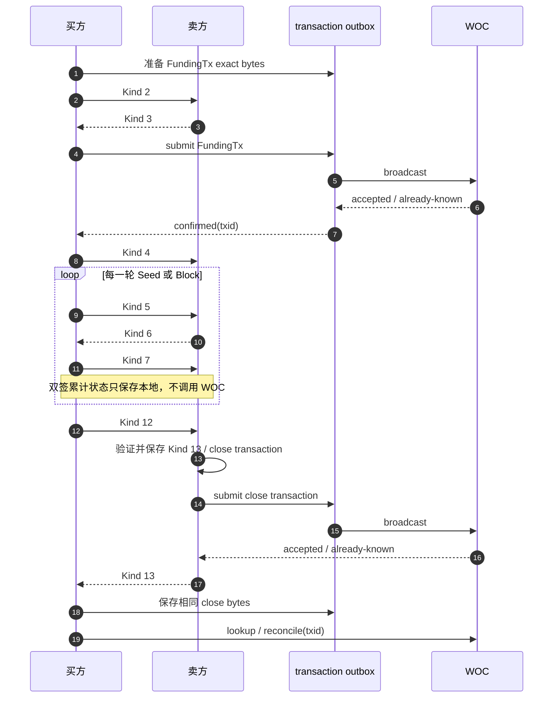
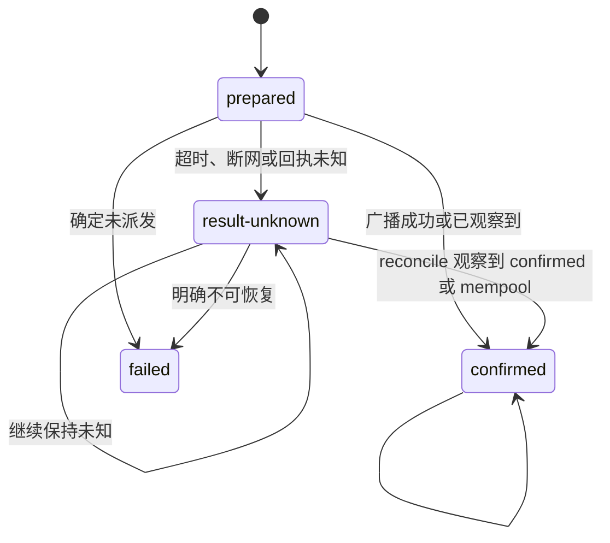

# 交易与广播

## 1. 先区分两类数据

BitFS 连接上传输的是协议 Artifact；WOC 只接收已经签名的 Bitcoin raw transaction。二者不能混为一条“BitFS 消息”。

| 数据 | 例子 | 传输位置 | 是否交给 WOC |
| --- | --- | --- | --- |
| 协议 Artifact | Kind 1、2、3、4、5、6、7、12、13 | WebRTC DataChannel 或多地址 BitFS stream | 否 |
| 池内累计状态交易 | Kind 7 双方签名后形成的 raw transaction | 当前正常路径只保存在双方本地证据 | 否 |
| 开池交易 | FundingTx | 交易 outbox | 是，由买方提交 |
| 最终关池交易 | Kind 13 验证后的完整 close transaction | 交易 outbox | 是，由卖方提交 |
| 到期退款 | 买方构造的 refund transaction | 交易 outbox | 是，由买方提交 |

Artifact 帧必须是可重新解析的规范编码。WebRTC runtime 和卖方 stream runtime 都会在入口解析、限制大小，并在入口再次检查字节是否与规范序列化完全相同。相关代码：`webrtcStreamRuntime.ts:592-637`、`sellerStreamRuntime.ts:232-271`。

## 2. Kind 1–13 对照表

| Kind | 方向 | 中文作用 | Keymaster 当前处理 | WOC |
| ---: | --- | --- | --- | --- |
| 1 | 卖方 → 买方 | 报价 | 卖方持久化并首帧发送；买方验签并固定 | 否 |
| 2 | 买方 → 卖方 | 开池请求和买方签名 | 买方保存 exact；卖方生成预签响应 | 否 |
| 3 | 卖方 → 买方 | 卖方退款预签 | 买方验证开池证据 | 否 |
| 4 | 买方 → 卖方 | FundingTx 交付证明 | 买方在 FundingTx 接受/观察后发送 | 否 |
| 5 | 买方 → 卖方 | Seed 或 Block 内容授权 | 买方保存请求和授权编号 | 否 |
| 6 | 卖方 → 买方 | 内容交付 | 买方验证并可靠暂存 | 否 |
| 7 | 买方 → 卖方 | 买方付款更新签名 | 卖方补签并保存本地累计状态 | 当前正常路径否 |
| 8 | 卖方 → 仲裁方 | 仲裁请求 | SDK/schema 有定义；当前业务路由未接线 | 未接线 |
| 9 | 仲裁方 → 卖方 | 仲裁回执 | SDK/schema 有定义；当前业务路由未接线 | 未接线 |
| 10 | 买方 → 仲裁方 | 取回请求 | SDK/schema 有定义；当前业务路由未接线 | 未接线 |
| 11 | 仲裁方 → 买方 | 可取回/不可取回响应 | SDK/schema 有定义；当前业务路由未接线 | 未接线 |
| 12 | 买方 → 卖方 | 最终关池请求 | 买方绑定最新 Kind 5/7 状态后发送 | 否 |
| 13 | 卖方 → 买方 | 卖方签名的完整关池响应 | 卖方保存完整交易并广播；买方验证 | 间接：卖方提交 close transaction |

卖方当前只把 Kind 2、4、5、7、12 交给业务处理，其它 Kind 返回 `unexpected_kind`；买方当前只接受 Kind 1、3、6、13。Kind 8–11 是 SDK 和 journal schema 的兼容容量，不应写成已经可用的仲裁流程。代码入口：`sellerProtocol.ts:137-345`、`buyerProtocol.ts:524-554`、`sessionJournal.ts:63-120`。

## 3. 开池、池内付款和关池的广播边界



### 3.1 Kind 7 为什么不上链

池内付款更新是同一 opening output 上的累计状态候选。买方先用最新 Kind 5/7 重新计算下一轮，卖方用自己保存的 Kind 5、6、7 和双签交易核对序号及累计金额；当前业务路径不把这些候选逐笔提交到 WOC。最终 Kind 12 才把累计状态封装为 sequence `0xffffffff` 的关池交易。

这意味着“下一轮 Kind 5 能发送”表示卖方接受了上一轮的池内状态，不表示上一轮交易已经被节点接受。代码入口：`sellerProtocol.ts:200-267`、`buyerPoolState.ts:28-117`。

## 4. 交易 outbox

每笔需要广播的 raw transaction 都先写入独立交易 outbox：

```text
transactions/<txid>.bin   原始交易字节
transactions/<txid>.json  状态、尝试次数和诊断信息
```

outbox 状态机如下：



`submit` 和 `retry` 只重放已经保存的 exact bytes；`reconcile` 只按 txid 查询，不广播、不重签。同一 txid 绑定不同字节时会直接失败。代码入口：`broadcast.ts:17-65`、`broadcast.ts:153-253`。

### 4.1 广播结果

| 结果 | 含义 | 后续动作 |
| --- | --- | --- |
| `confirmed` | WOC 接受交易，或查询观察到 confirmed/mempool | 推进对应 Funding/close/refund 账本状态 |
| `result-unknown` | Provider 可能已收到，但当前无法确定 | 保持原 txid、输入和池输出保护，稍后 reconcile |
| `failed` | 明确未派发或无法恢复 | 只有安全条件满足时释放预签 claim；不能把未知当失败 |

`confirmed` 的注释和实现都明确表示“节点接受/观察”，不表示已经达到某个区块确认数。成熟退款另外使用显式 `blockHeight` 和池花费查询。

## 5. WOC 适配层

`createBitfsWocChainPort` 只做两件事：

```text
broadcast(network, rawTxHex)
  → 校验 Provider 返回的 canonicalTxid
  → accepted 或 already-known

lookupTransaction(network, txid)
  → confirmed / mempool / absent / unknown
```

它不验证 Artifact、不持有私钥、不选择交易，也不推进业务阶段。WOC 适配代码：`wocChain.ts:10-31`。

启动时 `reconcileBitfsTransactions` 会扫描 outbox：已确认记录直接返回以修复会话投影，`failed` 跳过，`prepared` 和 `result-unknown` 只按原 txid 查询。`reconcileBitfsSessionTransactions` 不会仅凭 outbox 确认就把买方推进到完成；买方还必须同步专款账本、保存 Kind 4 或核对已验收内容。代码入口：`wocChain.ts:34-97`。

## 6. 各类交易的责任人

| 交易 | 准备方 | 广播方 | 观察方 | 备注 |
| --- | --- | --- | --- | --- |
| 普通余额拆分 | Worker / P2PKH prepare | Worker 交易 outbox | 买方 Worker | 目标是本文件专款 |
| 费用池 FundingTx | 买方 | 买方，Kind 3 验证后 | 买卖双方 | 买方先观察再发 Kind 4 |
| Kind 7 累计状态 | 双方本地协议步骤 | 当前无 WOC 调用 | 双方本地 journal | 下一轮和关池依据 |
| 最终关池交易 | 卖方生成完整交易 | 卖方 | 买方按 txid 对账 | 买方不提交第二份 |
| 到期退款 | 买方生成 exact 交易 | 买方 | 买方 | 仅在池未花费且退款成熟时构造 |
| 仲裁交易 | 当前业务未接线 | 当前业务未接线 | 当前业务未接线 | 不要把 schema 当成运行能力 |

## 7. 交易原文的恢复规则

- 需要与 session 绑定的 FundingTx、关池交易和退款交易原文先写入会话 evidence，再写入交易 outbox。
- 重启时从 evidence 原文重新计算 canonical txid，补齐 outbox 或账本时不重新签名。
- 交易 outbox 记录 `prepared` / `result-unknown` 时，输入和池输出继续受保护。
- 只有交易原文、账本计划、会话绑定和 txid 全部一致，才允许进入对账或业务完成。
- 买方收到 Kind 13 后，必须有对应的 Kind 12 和完整交易证据；正常路径还会校验已保存的 Kind 5/7 关池绑定，发现不一致就拒绝而不是猜测。

## 8. 当前未接线的协议分支

Kind 8–11 的格式、错误码和 evidence 名称存在于 `sessionJournal.ts`，但当前 `sellerProtocol` 和 `buyerProtocol` 的业务 dispatch 没有处理它们；仲裁阶段和取回阶段也没有进入 Worker 的广播矩阵。因此当前文档不承诺 Keymaster 已经能够作为仲裁方或通过仲裁取回内容。
