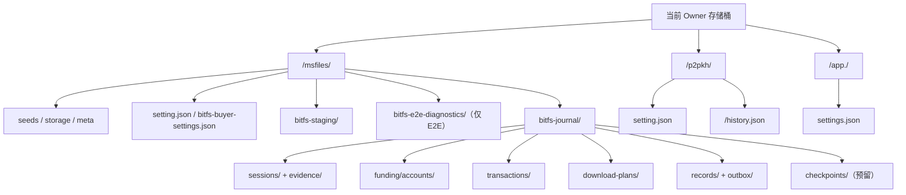
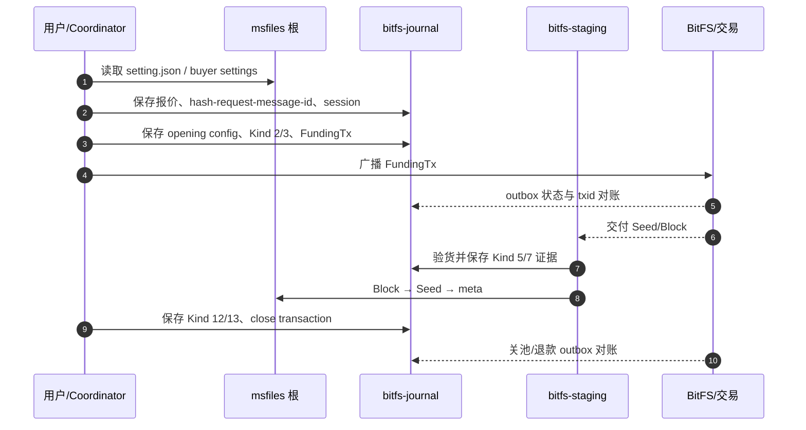

# 存储布局与生命周期

本文记录 BitFS 业务链直接写入、读取或依赖的 OwnerFileStore 文件，以及为理解资金依赖而列出的同 Owner P2PKH 外部文件；内容包括物理根、文件格式、用途和生命周期。协议流程见[业务与流程](./业务与流程.md)，资金状态见[资金与账本](./资金与账本.md)，恢复规则见[状态与恢复](./状态与恢复.md)。

## 1. 先区分“逻辑路径”和“桶内对象路径”

业务代码拿到的是 `OwnerFileStore` 的相对路径；Host/Coordinator 根据 owner、module、purpose 计算真实桶内根，再交给 Provider。业务代码不能自行拼接物理路径。

| 逻辑句柄 | module / purpose | 桶内对象根（省略 bucket id） | 主要用途 |
| --- | --- | --- | --- |
| `createWorkerOwnerFileStore("msfile", "")` | `msfiles` / 空 purpose | `<owner>/msfiles/` | MSFile 内容、设置、买方工作区 |
| `createWorkerOwnerFileStore("msfile", "bitfs-journal")` | `msfiles` / `bitfs-journal` | `<owner>/msfiles/bitfs-journal/` | BitFS 会话、证据、账本、outbox |
| App 设置句柄 | `app` / `app-settings` | `<owner>/app.<publisherPublicKeyHex>/` | App 的 MSFile 额度和使用时间 |
| P2PKH 设置句柄 | `p2pkh` / 空 purpose | `<owner>/p2pkh/` | BitFS 依赖的手续费、testnet 和 Provider 设置 |
| P2PKH 历史句柄 | `p2pkh` / 空 purpose | `<owner>/p2pkh/` | P2PKH 历史同步的 txid/高度/手续费元数据；不是 BitFS 自己写入 |

`<owner>` 是当前 Key 的压缩公钥。文件模型直接落在 owner 下的 `<module>/<purpose>/`；空 purpose 表示模块根。App 文件使用 `<owner>/app.<publisher>/` 根。代码入口：`packages/contracts/src/storage/access.ts:135-194`、`packages/platform-storage/src/storage-access/owner-app/ownerFileStore.ts:38-69`、`apps/web/src/keymasterSessionCoordinator.worker.ts:9216-9314`。



## 2. 文件分类总表

| 分类 | 文件 | 内容格式 | 写入时机 | 当前生命周期 |
| --- | --- | --- | --- | --- |
| 长期内容 | `seeds/<seedHash>.ms` | 原始 MasterSeed 字节 | 上传或购买内容最终提交 | 用户删除或 Owner 删除前保留 |
| 长期内容 | `storage/<seedHash>/<blockHash>` | 原始 Block 字节 | 上传或购买内容最终提交 | 用户删除或 Owner 删除前保留 |
| 长期内容索引 | `meta/<seedHash>.json` | `keymaster.msfiles-meta` JSON | Block 和 Seed 写完之后 | 用户删除或 Owner 删除前保留 |
| 长期设置 | `setting.json` | `keymaster.msfiles-setting` JSON | 修改全局价格、并发、供应商、卖方设置 | 用户修改或 Owner 删除前保留 |
| 长期买方设置 | `bitfs-buyer-settings.json` | `keymaster.msfile-bitfs-buyer-settings` JSON | 修改自动购买和单文件限额 | 用户修改或 Owner 删除前保留 |
| 长期会话索引 | `bitfs-journal/sessions/<sessionId>.json` | `keymaster.bitfs-session` JSON | 创建或推进每个买卖会话 | 当前代码没有单会话自动删除 |
| 长期协议证据 | `bitfs-journal/evidence/<sessionId>/<name>.bin` | exact Artifact、摘要、签名或 raw transaction | 每次发送、签名、交付、关池前 | 当前代码没有单 evidence 自动删除 |
| 长期资金账本 | `bitfs-journal/funding/accounts/<network>/<seedHash>.json` | `keymaster.bitfs-funding-account` JSON | 拆分、开池、关池、退款状态变化 | 当前代码没有按 Seed 自动删除 |
| 长期交易原文 | `bitfs-journal/transactions/<txid>.bin` | 已签名 raw transaction | 专款拆分、Funding、关池或退款进入 outbox | 当前代码没有按 txid 自动删除 |
| 长期交易索引 | `bitfs-journal/transactions/<txid>.json` | `keymaster.bitfs-tx` JSON | outbox 状态、尝试次数、错误变化 | 当前代码没有按 txid 自动删除 |
| 长期共享计划 | `bitfs-journal/download-plans/<seedHash>.json` | `keymaster.bitfs-buyer-download-plan` JSON | 买方建立同 Seed 多卖家计划 | 计划完成后仍保留；池状态写入 `closed` |
| 长期报价 outbox | `bitfs-journal/records/<requestHash>.json` | `keymaster.bitfs-journal` JSON；通用 journal 记录索引 | 卖方报价索引；`putCheckpoint` 也会写 records | 当前代码没有自动删除 |
| 长期报价原文 | `bitfs-journal/outbox/<requestHash>.cbor` | 规范化 BitFS Artifact 字节 | 卖方报价发送前 | 当前代码没有自动删除 |
| 预留接口 | `bitfs-journal/checkpoints/<id>.bin` | 不透明 checkpoint 字节 | `BitfsJournal.putCheckpoint` API | 当前生产调用点未发现，默认不会产生 |
| 工作区 | `bitfs-staging/...` | 已验 Seed/Block 原始字节 | Kind 6 验证后、Kind 7 前 | 逻辑上是临时区，但当前没有自动删除 |
| 测试诊断 | `bitfs-e2e-diagnostics/*.json` | JSON 诊断快照 | 仅 `VITE_BITFS_E2E=true` | 仅测试环境使用；不是业务真值 |
| 长期外部设置 | `<owner>/p2pkh/setting.json` | `keymaster.p2pkh-setting` JSON | 用户修改 P2PKH 设置 | BitFS 读取手续费和链配置，不由此处写入 |
| 长期外部历史 | `<owner>/p2pkh/<main|test>/history.json` | `keymaster.p2pkh-history` JSON | P2PKH 历史同步 | 保存 txid/确认高度/手续费元数据；不是 BitFS 交易真值 |
| 长期 App 设置 | `<owner>/app.<publisher>/settings.json` | `keymaster.app-settings` JSON | App 首次使用、额度变化、更新时间 | MSFile 授权和用量记录 |

“长期”表示当前代码没有自动把它当作可丢弃缓存；它不等于永远不能删除。Owner 删除流程会尝试按 owner 前缀物理删除该 Owner 的对象；Provider/CAS 失败或清理轮数耗尽时可能留下残留。

## 3. 长期用户内容：`msfiles/`

### 3.1 三个内容文件


- `seeds/<seedHash>.ms`：MasterSeed 原始字节，不是 JSON；长度是 32 的整数倍，每个 32 字节摘要对应一个 Block。
- `storage/<seedHash>/<blockHash>`：Block 原始字节；文件名是 Block 内容 SHA-256 的小写 hex，标准块上限 256 KiB，最后一块按文件大小截断。
- `meta/<seedHash>.json`：文件元数据，也是列表真值。格式为 `keymaster.msfiles-meta`，字段为 `format`、`version`、`seedHashHex`、`fileName`、`mediaType`、`fileSizeBytes`、`blockCount`、`seedSizeBytes`、`storedAt`。

上传和购买最终提交都遵循：

```text
Block → Seed → meta
```

`meta` 是最后的 available 提交点。中断在 `meta` 之前可能留下块或 Seed，但列表不会把它们当作完整文件。购买提交还会再次用 `masterseed` 校验 Seed Hash、文件大小、块数和每块 Hash，不信任网络层声明。

代码入口：`packages/plugin-msfile/src/storage/msfileSeedStore.ts:1-13,74-99,171-180,213-265,435-505,508-572`。

### 3.2 长期内容的读取和删除

- 列表只读 `meta/`，一个 `meta` 文件对应一个文件条目。
- local Stat 还会读取 Seed、验证 Seed Hash/大小/块数，并检查每个 Block 是否存在；Block 字节 Hash 在实际读取时验证。
- `readLocalMsFileBlock` 先确认 Block 属于指定 Seed，再检查长度和 Hash。
- `deleteMsFileSeed` 的删除顺序是 `meta → seeds → blocks`。先删 `meta` 让条目从列表消失，再删除 Seed 和按 Seed 摘要得到的 Block。

代码入口：`msfileSeedStore.ts:604-693,695-800,939-981`。

### 3.3 购买完成后的两份内容

购买过程中，验货后的内容先写入工作区；全部内容完成后，`commitPurchasedMsFileContent` 再写入 `storage/`、`seeds/` 和 `meta/`。因此工作区和正式内容可能同时存在同一份字节；正式 `meta` 才是可读取文件真值。

## 4. 长期设置文件

### 4.1 `msfiles/setting.json`

这是当前 Key 的 MSFile 总设置文件，格式 `keymaster.msfiles-setting`，当前写入版本为 2。主要保存：

- 全局 Seed / Block 金额上限；
- 读取并发设置；
- 卖方开关、Seed 价、完整 Block 价、报价期限、仲裁方列表和最大销售会话数；
- 用户供应商列表。官方内置供应商由代码合并，不由此文件覆盖。

文件是整文件读-改-写；未知字段拒绝。代码入口：`packages/plugin-msfile/src/storage/msfileRepository.ts:35-43,195-256,275-300`。

### 4.2 `msfiles/bitfs-buyer-settings.json`

这是独立 schema 的 BitFS 买方设置，格式 `keymaster.msfile-bitfs-buyer-settings`，主要保存：

- 是否自动购买；
- 自动购买允许的完整 Block 最高价；
- 卖家选择优先级：价格或最近速度；
- 同时处理的文件任务数；
- 单个文件同时参与的卖家费用池数；
- 按 Seed Hash 保存的用户强制下载最高价。

缺少此文件时使用安全缺省：自动购买关闭、最高价为 `0`、并发为有界小值。代码入口：`msfileRepository.ts:259-273,487-496`、`packages/contracts/src/msfile.ts:348-415`。

### 4.3 其它长期配置

- `<owner>/p2pkh/setting.json`：保存 `includeTestnet`、手续费档位和允许的 WoC Provider 配置。BitFS 买方在准备会话和交易时读取 `medium` 费率；BitFS 不直接写这个文件。
- `<owner>/p2pkh/<main|test>/history.json`：P2PKH 历史同步写入的 `keymaster.p2pkh-history` JSON，记录 txid、确认高度和可选手续费；它属于 P2PKH 历史链，不是 BitFS 专款账本或 BitFS outbox。
- `<owner>/app.<publisher>/settings.json`：保存 App 名称、首次/最近观察时间，以及该 App 的 MSFile Seed/Block 价格覆盖。它属于 MSFile 授权链，不是某个 BitFS session 的协议证据；清除额度只删除 `apps.<appId>.msfiles` 字段，文件和 App 观察记录仍保留。

## 5. 长期 BitFS journal：`msfiles/bitfs-journal/`

`bitfs-journal` 是独立的 owner 文件 purpose，声明为 `model: "files"`、`scope: "owner"`、`schemaVersion: 1`。它和内容、MSFile 设置、App 用量分开，目的是防止不可逆协议证据与普通文件混写。代码入口：`packages/contracts/src/storage/systemStorageDeclarations.ts:197-219`。

### 5.1 会话索引：`sessions/`

```text
sessions/<sessionId>.json
```

内容是 `keymaster.bitfs-session` JSON，主要字段：

- `sessionId`、`role`、`ownerPublicKeyHex`、`counterpartyPublicKeyHex`、`seedHashHex`；
- `generation`、卖方运行实例 `runtimeInstanceId`；
- `phase`、`pendingTxid`、`pendingAuthorizationId`、`deadlineUnixSeconds`、`refundLockTime`；
- `failureCode`、`revision`、`updatedAt`；
- `evidence[]` 证据文件名列表。

会话记录通过 revision 和 Provider ETag 做 CAS 更新。当前 Worker 的未完成任务投影会过滤 `completed`、`cancelled`、`refunded`，但不会删除会话文件；`failed` 仍可能出现在任务投影中。因此 session 文件同时承担恢复索引和历史记录作用。代码入口：`packages/plugin-msfile/src/bitfs/sessionJournal.ts:8-13,122-169,172-245`。

### 5.2 会话证据：`evidence/`

```text
evidence/<sessionId>/<evidenceName>.bin
```

每个文件保存 exact bytes，不保存 SDK 对象。常见名称包括：

| 名称 | 保存内容 |
| --- | --- |
| `kind1-quote` | 已验签报价原文 |
| `opening-configuration` | 开池金额、仲裁方、退款时限和费率 JSON |
| `funding-transaction` | FundingTx raw transaction |
| `kind2-opening-request`、`kind3-opening-response`、`kind4-funding-delivery` | 开池阶段 Artifact |
| `kind5-content-request-<id>`、`kind6-content-delivery-<id>`、`kind7-payment-update-<id>` | 每轮内容授权、交付和买方付款签名 |
| `kind7-payment-sign-digest-<id>`、`kind7-payment-signature-<id>` | Kind 7 买方签名摘要和 DER 签名 |
| `latest-payment-transaction-<id>` | 卖方保存的双签累计池状态 raw transaction |
| `kind12-close-binding`、`kind12-close-request` | 关池前最新 Kind 5/7 绑定和买方关池请求 |
| `kind13-close-response`、`close-transaction` | 卖方关池响应和完整关池交易 |
| `refund-transaction` | 买方固定退款原文 |
| `purchase-manifest` | 不依赖过期报价的文件入库清单 |
| `download-plan` | 某会话固定的池预算和调度证据 |
| `file-price-limit` | 用户为本 Seed 保存的完整 Block 上限 |
| `seller-speed-sample-<id>` | 已验收 Block 的速度样本 JSON |

`putEvidence` 是 create-only：已有同名不同字节时拒绝；写入后回读逐字节校验，再把名称加入 session evidence 列表。代码入口：`sessionJournal.ts:63-120,211-225`。

### 5.3 买方计划：`download-plans/`

```text
download-plans/<seedHash>.json
```

这是同一 Owner + Seed 的共享调度计划，格式 `keymaster.bitfs-buyer-download-plan`，内容包括：

- 文件大小、推荐文件名、CAS `revision`；
- `seedCompleted`、`fileComplete`、`stopRequested`；
- 去重后的 `blockHashesHex`；
- 每个 Block 的 `claimed/completed` 状态、归属 session 和已付金额；
- 每个卖方池的固定 Seed/Block 预算、已付金额、最近速度和 active/closed 状态；
- 唯一的 `seedOwnerSessionId` 和每个池的 `inFlightBlockHashHex`。

它是跨多个卖方池的长期业务账。关池会把池标记为 `closed`，清除 `inFlightBlockHashHex`、删除该未完成 Block 认领，并在 Seed 尚未完成时清除该池的 Seed 归属，然后重写计划文件；不会删除计划、session、evidence 或 outbox 文件。代码入口：`packages/plugin-msfile/src/bitfs/buyerDownloadPlan.ts:5-16,85-116,118-178,326-341`。

### 5.4 专款账本：`funding/accounts/`

```text
funding/accounts/<main|test>/<seedHash>.json
```

格式 `keymaster.bitfs-funding-account`，一个网络和一个 Seed 一份账本。`getAccount` 在账本不存在时会先创建空账本文件（`funding.ts:309-317`）；之后内容包括：

- `utxos[]`：专款输出的 txid、vout、聪数、脚本和状态；
- `transactions[]`：拆分、开池、关池、退款交易的状态、输入、预期输出、P2PKH 提交编号、手续费、找零信息和 `inputsReconciled`；
- `pools[]`：池编号、FundingTx、opening outpoint、池状态和 recovery txid；
- `revision` 和 `updatedAt`。

专款输出状态只有 `split-pending`、`available`、`pool-occupied`、`recovery-pending`、`released`；费用池另有 `funding-pending`、`funding-failed`、`open`、`recovery-pending`、`closed`。结果未知时输入和池输出继续保护。当前没有按 Seed 删除账本的代码。代码入口：`packages/plugin-msfile/src/bitfs/funding.ts:17-119,242-317`。

### 5.5 交易 outbox：`transactions/`

```text
transactions/<txid>.bin
transactions/<txid>.json
```

- `.bin` 是已签名交易原文，canonical txid 由这份原文计算。
- `.json` 是 `keymaster.bitfs-tx` 恢复索引，状态为 `prepared`、`result-unknown`、`confirmed` 或 `failed`，并记录尝试次数、更新时间和最近错误。

`submit` 和 `retry` 只重放已保存的 exact bytes；`reconcile` 只按 txid 查询。Kind 7 累计状态在当前正常路径不进入这个 outbox。交易完成后文件仍保留，作为恢复和审计依据。代码入口：`packages/plugin-msfile/src/bitfs/broadcast.ts:17-123,153-253`。

### 5.6 卖方报价 journal：`records/` 和 `outbox/`

```text
records/<requestHash>.json
outbox/<requestHash>.cbor
```

`requestHash` 是已验证 Hash 请求的 `from_public_key + NUL(0x00) + message_id` 的 SHA-256。`records` 保存 `keymaster.bitfs-journal` 索引；`outbox` 保存卖方 Kind 1 报价的 exact Artifact 字节。新报价在发送前调用 `prepareOutbound`；已存在的卖方会话则优先复用 session evidence 中的原 Kind 1，不会为重连生成第二条报价。

`checkpoints/<id>.bin` 是同一 journal 接口预留的不透明 checkpoint 路径；`putCheckpoint` 写入 checkpoint 字节并会更新同一条 `records` 记录，但当前生产代码没有发现该调用点，因此不能把它当作每次交易必然产生的文件。代码入口：`packages/plugin-msfile/src/bitfs/journal.ts:1-47,60-105`、`sellerRuntime.ts:109-128,135-139`。

## 6. 临时/工作区文件

### 6.1 BitFS 验货暂存：`bitfs-staging/`

逻辑路径有两种：

```text
bitfs-staging/by-seed/<seedHash>/seed.bin
bitfs-staging/by-seed/<seedHash>/blocks/<blockHash>.bin

bitfs-staging/<sessionId>/seed.bin
bitfs-staging/<sessionId>/blocks/<blockHash>.bin
```

- 共享下载计划使用 `by-seed`，同一 Seed 的多个卖方池共用已验 Seed 和 Block。
- 旧版单池会话使用 `sessionId` 路径。
- 文件是 go-bitfs 验证通过后的原始 Seed/Block 字节；写入使用 `ifNoneMatch: "*"`，同路径不同字节会失败。
- 它是付款前的可靠工作副本，不是正式 MSFile 内容，也不是链上交易证据。

**重要生命周期事实：当前代码没有发现 BitFS 工作区的自动删除路径。** 文件提交到 `msfiles/storage`、`seeds`、`meta` 后，工作区副本仍可能留在桶内；会话结束或页面关闭不会自动清理它。需要把它当作“逻辑临时、物理持久化”的文件，不能假设系统会自动回收。

代码入口：`packages/plugin-msfile/src/bitfs/buyerProtocol.ts:86-101,1330-1370,1540-1544`、`apps/web/src/keymasterSessionCoordinator.worker.ts:4599-4600`。

### 6.2 上传/购买中断留下的孤儿内容

正式内容采用 `Block → Seed → meta`。如果在 `meta` 写入前中断：

- `meta` 缺失时，列表和 local Stat 不会报告该文件为可用；
- 已写入的 Block/Seed 可能成为孤儿对象；
- 后续相同 Seed 再次提交可以复用/覆盖相同内容路径；
- 当前没有通用垃圾收集器自动删除这些孤儿文件。

用户删除一个已知 Seed 时，`deleteMsFileSeed` 不要求 `meta` 存在：它会先尝试删除 meta（不存在视为成功），再删除 Seed；如果 Seed 缺失或结构不合法，则退回列举 `storage/<seedHash>/` 并删除块。因此已知 Seed Hash 仍可用于清理孤儿内容。代码入口：`msfileSeedStore.ts:435-505,508-572,939-981`。

### 6.3 E2E 诊断文件

```text
bitfs-e2e-diagnostics/<name>.json
```

只有 `import.meta.env.VITE_BITFS_E2E === "true"` 时才写入；内容可能包含 owner/peer 公钥、request/session 编号、文件名、堆栈、完整签名交易 `rawTxHex` 和 WOC base URL。它们用于 E2E 失败定位，不是业务恢复真值，也不应被当作脱敏生产数据。代码入口：`apps/web/src/keymasterSessionCoordinator.worker.ts:6211-6218`。

## 7. 只在内存中的状态

下列状态不写文件，重启、锁定或 Worker 重建后由代码重新建立：

| 内存状态 | 用途 | 重建/失效方式 |
| --- | --- | --- |
| Seed 索引 `Map<seedHash, summary>` | 卖方快速匹配完整文件 | 从 `msfiles/meta`、Seed 和 Block 存在性分页重建 |
| 买方 task / quote / link Map | 当前需求、报价、DataChannel 连接 | 锁定、切 Key、过期或 runtime dispose 后清理 |
| WebRTC session、inbound pending stream、ICE 缓冲 | 传输建连和帧路由 | 连接结束、锁定期限或 runtime dispose |
| `contentRequestStartedAtMs`、串行锁、下载任务尾部 Promise | 单会话顺序和速度计算 | 进程内生命周期 |
| Funding Ledger 的串行 mutation 锁 | 同一账本写入排队 | 进程内锁；账本内容仍在文件 |

Seed 索引代码入口：`packages/plugin-msfile/src/bitfs/seedIndex.ts:28-87`；WebRTC runtime 内存字段入口：`packages/plugin-msfile/src/bitfs/webrtcStreamRuntime.ts:76-128`。

## 8. 业务阶段与文件写入关系



| 阶段 | 主要新增或更新文件 | 完成后是否仍需要 |
| --- | --- | --- |
| 发现需求/报价 | `records`、`outbox`、`sessions`、`kind1-quote`、`hash-request-message-id` | 恢复报价关联和会话身份 |
| 开池 | `opening-configuration`、`kind2/3/4`、`funding-transaction`、`funding/accounts`、FundingTx outbox | 需要；决定资金和协议恢复 |
| 每轮交付 | `bitfs-staging`、`kind5/6/7`、签名 evidence、plan | 需要；验货、付款和重连依据 |
| 文件提交 | `storage`、`seeds`、`meta`、`purchase-manifest` | 内容长期保留 |
| 关池 | `kind12/13`、`close-transaction`、pool recovery、outbox | 需要；决定余款是否已回收 |
| 取消/退款 | stop fence、Kind 12/13 或 `refund-transaction`、recovery outbox | 需要；防止重复花费 |
| 完成/关池后 | session、evidence、账本、交易、plan 文件 | 当前代码保留；Worker 的未完成任务投影过滤 `completed`、`cancelled`、`refunded`，不过滤 `failed` |

## 9. 清理和保留规则

### 会由业务显式清理的内容

- `deleteMsFileSeed` 只清理正式 `meta`、Seed 和 Block。
- 计划 `closePool` 会清除该池的未完成 Block 认领并重写 `download-plans` 文件，但不删除计划、session、evidence 或 outbox 文件。
- 任务投影当前过滤 `completed`、`cancelled`、`refunded` 三种阶段；它们会从“未完成任务”列表中消失，但不删除 journal。`failed` 不在这个过滤集合中。

### 当前没有自动清理的 BitFS 文件

在当前代码中没有发现针对以下路径的 per-session、per-txid 或 per-seed 删除调用：

```text
bitfs-journal/sessions/
bitfs-journal/evidence/
bitfs-journal/funding/
bitfs-journal/transactions/
bitfs-journal/download-plans/
bitfs-journal/records/
bitfs-journal/outbox/
bitfs-staging/
bitfs-e2e-diagnostics/
```

因此它们的实际含义是：

- 协议和资金文件：长期恢复/审计记录；
- `bitfs-staging`：逻辑临时但当前持久化的工作副本；
- E2E 诊断：仅测试开关下的诊断残留。

### Owner 删除

平台提供 Owner 级物理清理：按 `<owner>/` 前缀分页列出并删除对象，直到连续多次列表为空。这是 Owner 删除流程的一部分，属于 best-effort 的必需清理；Provider/CAS 失败或达到清理轮数上限时可能留下残留，也不会回滚已经删除的对象。它不是 BitFS 业务层的“删除会话”或“删除文件”接口。代码入口：`packages/platform-storage/src/storage-access/platform-root/platformRootStore.ts:45-77,235-238`。

## 10. 不写入这些文件的内容

- 私钥、Vault 明文密钥和 signer 对象：只通过受限 `ActiveKeyCrypto` 使用。
- WOC 凭据、Provider token 和完整节点历史：属于其它存储/服务边界，BitFS 只保存 raw transaction 和 txid 事实。
- P2PKH 的 UTXO 快照、协议花费 submission、输入 claim 和运行时状态：主要在 P2PKH K-V/内存中，不是 `msfiles/` 或 `bitfs-journal` 文件；BitFS 通过受限端口调用它们。
- WebRTC SDP、ICE、DataChannel、Noise/Yamux 状态：只在内存和临时网络对象中；只有 E2E 开关打开时才写测试诊断 JSON，诊断可能包含公钥、编号、完整交易和 WOC 地址。
- Seed 索引：是从正式内容派生的内存缓存，不是文件真值。
- go-bitfs SDK 实例、MultisigPool engine 和 SDK 工作流 checkpoint 对象：不序列化到 OwnerFileStore；应用只保存普通 JSON 和 exact bytes。`BitfsJournal.putCheckpoint` 是另一个预留的通用文件接口，不等于保存 SDK 实例。

## 11. 代码真值索引

- 存储声明和物理根：`packages/contracts/src/storage/systemStorageDeclarations.ts:197-232`、`packages/contracts/src/storage/access.ts:135-194,152-164`
- OwnerFileStore 绑定和切 Key 失效：`apps/web/src/keymasterSessionCoordinator.worker.ts:9216-9314`
- MSFile 正式内容布局：`packages/plugin-msfile/src/storage/msfileSeedStore.ts:1-13,171-265`
- 上传/购买提交/删除：`msfileSeedStore.ts:435-572,939-981`
- 设置文件：`packages/plugin-msfile/src/storage/msfileRepository.ts:35-43,195-300,371-500`
- 报价 journal：`packages/plugin-msfile/src/bitfs/journal.ts:1-105`、`sellerRuntime.ts:109-139`
- 会话和 evidence：`packages/plugin-msfile/src/bitfs/sessionJournal.ts:63-245`
- 下载计划：`packages/plugin-msfile/src/bitfs/buyerDownloadPlan.ts:5-178,326-341`
- 资金账本：`packages/plugin-msfile/src/bitfs/funding.ts:17-119,242-317`
- P2PKH 外部设置和历史：`packages/plugin-p2pkh/src/storage/p2pkhFileFormats.ts:1-29,38-78,176-179`、`packages/plugin-p2pkh/src/storage/p2pkhFileRepository.ts:45-57`、`packages/plugin-p2pkh/src/storage/p2pkhStateRepository.ts:189-198`、`packages/plugin-p2pkh/src/p2pkhTransactionSync.ts:60-84`
- 交易 outbox：`packages/plugin-msfile/src/bitfs/broadcast.ts:17-123`
- 验货工作区：`packages/plugin-msfile/src/bitfs/buyerProtocol.ts:86-101,1330-1370,1540-1544`
- 解锁恢复和任务投影：`apps/web/src/keymasterSessionCoordinator.worker.ts:3765-4095,4182-4413`
- E2E 诊断开关：`apps/web/src/keymasterSessionCoordinator.worker.ts:6211-6218`
