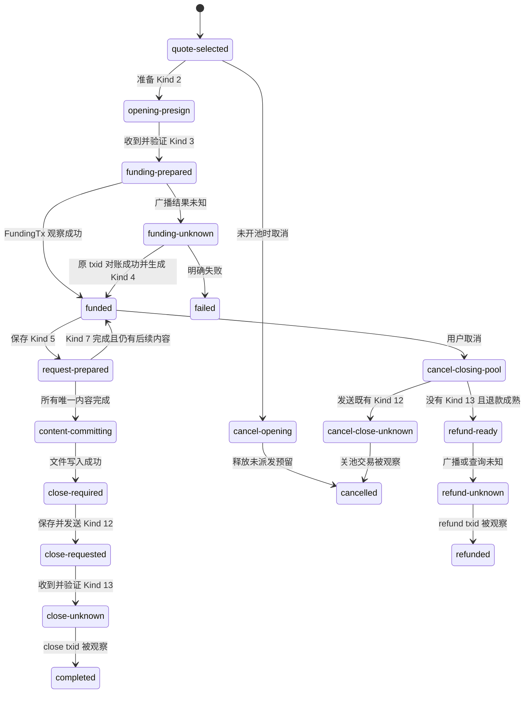
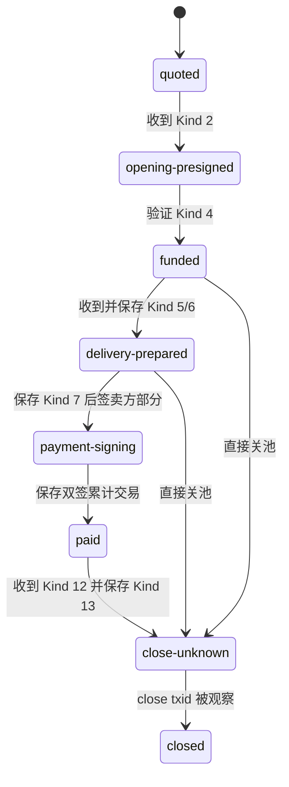
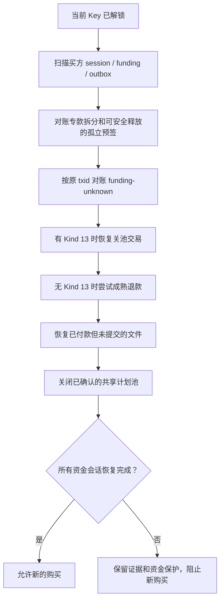
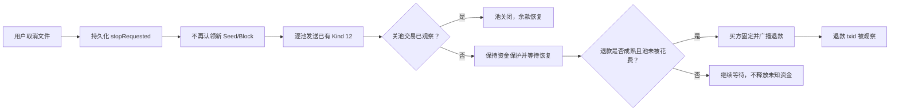

# 状态与恢复

## 1. 状态记录的原则

BitFS 协议步骤由 go-bitfs 计算，Keymaster 自己保存业务阶段和恢复所需证据。阶段不是网络连接状态，也不是交易确认数；同一个会话可能同时存在“DataChannel 已关闭”和“关池交易仍待对账”。

每条会话记录至少包含：

- `role`：买方或卖方；
- 当前 Key、对端公钥、Seed Hash；
- `generation` 和可选 `runtimeInstanceId`；
- `phase`、`pendingTxid`、`pendingAuthorizationId`；
- evidence 名称、CAS `revision`、失败码和截止时间。

代码入口：`packages/plugin-msfile/src/bitfs/sessionJournal.ts:122-169`。

## 2. 买方状态机

### 2.1 正常路径的关键点

- `quote-selected` 之后才允许准备开池资金；只查询报价不会拆余额。
- `funding-prepared` 表示 FundingTx 和 Kind 2/3 证据已经准备好，不表示 FundingTx 已广播。
- `funded` 表示 FundingTx 被观察、账本同步并且 Kind 4 可以发送。
- `request-prepared` 绑定一个 `PaymentAuthorizationID`；该编号是这一轮 Kind 5/6/7 的关联键。
- Kind 6 验证并暂存后，Kind 7 被保存并发送；未完成一轮时阶段回到 `funded` 或继续共享计划。
- 文件内容全部完成后，先进入 `content-committing` 并写入正式存储，再进入 `close-required`。
- `completed` 需要关池交易被观察并且专款账本完成回收，不是只收到 Kind 13。

### 2.2 声明阶段与正常写入的差异

`sessionJournal.ts` 为兼容恢复定义了 `discovering`、`delivery-verified`、`payment-unknown` 和 `arbitration-retrieval`。当前正常买方代码中：

- `discovering` 主要用于 Worker 的任务展示，不是新建 session 的阶段；
- `payment-unknown` 会作为进度文案出现，但 Kind 7 完成后通常直接回到 `funded` 或进入 `content-committing`；
- `delivery-verified` 没有找到正常 `sessions.update` 写入路径；
- `arbitration-retrieval` 没有当前买方处理路径。

文档和 UI 不应把这些 schema 名称当作已经完成的业务步骤。买方阶段到 UI 文案的映射在 `buyerProtocol.ts:1439-1455`。

## 3. 卖方状态机

卖方 `payment-unknown`、`arbitration-prepared` 和 `arbitration-payment-unknown` 是 schema 中的可接受输入状态；当前正常 `sellerProtocol` 没有把它们作为普通交付路径写入。`failed` 也不由 transport 关闭自动写入，连接清理和协议阶段是两条不同路径。

卖方每一帧都通过 `sellerSession` 的单会话串行队列处理。重复请求优先查找已保存 evidence，不会再次解析内容或创建另一份交付。代码入口：`sellerProtocol.ts:137-345`、`sellerSession.ts:212-277`。

## 4. 解锁后的恢复顺序

Coordinator 在暴露新的 BitFS 买方购买前先执行全量恢复：

Worker 逐条处理同一 Key 的未完成买方会话；单条恢复失败不会删除原 evidence 或释放不确定资金，而是让新购买保持等待。代码入口：`apps/web/src/keymasterSessionCoordinator.worker.ts:3765-3867`、`3998-4095`。

恢复会反复检查：

- 当前 owner、session epoch 和 keyspace generation；
- FundingTx 的 exact bytes、txid、输入和找零；
- Kind 12/13 与最新 Kind 5/7 绑定；
- 关池交易的输入是否为该费用池的当前状态；
- 本地暂存的 Seed/Block 是否完整；
- 账本和 outbox 的状态是否一致。

## 5. 崩溃点与恢复结果

| 崩溃或中断位置 | 已可能保存的内容 | 恢复动作 |
| --- | --- | --- |
| 报价已验证、尚未准备 Kind 2 | Kind 1、quote summary | 重新从固定报价准备，不重新发现报价 |
| FundingTx 已准备、尚未发 Kind 2 | opening config、FundingTx、账本占用 | 校验并恢复原 txid；不重新签名 |
| Kind 2 已发、未收到 Kind 3 | Kind 2、买方签名、FundingTx | 重发 exact Kind 2；卖方复用 exact Kind 3 |
| FundingTx 广播结果未知 | outbox、账本 `result-unknown`、会话 `funding-unknown` | 只按原 txid reconcile |
| Kind 6 已到达、Kind 7 尚未保存 | Kind 5/6、已验货暂存 | 重放同一验货步骤；已有摘要时按 fail-closed 规则复用或拒绝，不生成不同签名 |
| Kind 7 已保存、卖方尚未收到 | 买方 Kind 7 和摘要 | 重发 exact Kind 7，不创建新付款序号 |
| Kind 12 已保存、未收到 Kind 13 | close binding、Kind 12、买方签名 | 重发 exact Kind 12 |
| Kind 13 和 close transaction 已保存 | 卖方响应、完整 raw、outbox | 按原 txid reconcile，不重新构造 |
| 文件已写入、关池失败 | 正式文件和 close request | 继续关池；不能把文件完成等同于资金回收 |
| 退款交易已广播但结果未知 | refund exact bytes、`refund-unknown` | 只查询或重放原 raw transaction |

## 6. 断线和重连

断线不会自动删除会话或释放已形成的资金责任。恢复后的重新连接需要：

1. 当前 Key 仍解锁且 generation 有效；
2. 重新发布或接收有效 Hash 需求；
3. 卖方重新匹配到同一 Seed 和对端公钥；
4. 买方收到必须与旧会话完全相同的 Kind 1；
5. 唯一匹配旧 session 后，才恢复对应 Kind 4、Kind 5、Kind 7 或 Kind 12。

卖方运行时如果同一买方、同一 Seed 存在多个可恢复未完成池，会保持静默，因为仅凭需求不能安全判断应该接管哪一个池。代码入口：`sellerRuntime.ts:80-107`、Coordinator Worker `6656-6722`。

## 7. 取消和退款

### 7.1 取消

取消首先写入文件级 stop fence，立即停止新的 Seed/Block 请求。已开池的池仍必须逐个发送或重放已有 Kind 12，等待卖方 Kind 13 和回收交易观察；尚未开池且能证明未派发的预签才可安全释放。

### 7.2 到期退款

只有没有完整 Kind 13 关池证据、池输出仍可按规则退款且退款锁已经成熟时，买方才构造退款。构造前和广播前都会重新查询池当前花费关系；若池已被其它交易花费，退款路径停止，不制造冲突花费。

退款也遵守 exact bytes 规则：首次固定后只按原 txid 查询或重试，不因重启生成第二笔退款。代码入口：`buyerTask.ts:819-977`。

## 8. 生命周期撤销

以下事件会推进 generation、清理连接并拒绝迟到结果：

- 手动锁定；
- 切换当前 Key；
- 切换 Owner 存储；
- 停止 MSFile 运行单元；
- 关闭卖方开关；
- Worker 重建或 Window lease 释放。

卖方 session manager 在打开 transport 前验证容量、身份、报价 exact bytes 和 generation；打开后发现 generation 变化会主动关闭连接。买方异步任务在签名、广播、内容提交和状态更新边界都会重新检查当前 owner 和 generation。代码入口：`sellerSession.ts:162-209`、`apps/web/src/keymasterSessionCoordinator.worker.ts:5684-5691`。

## 9. 当前未接线与验证边界

- Kind 8–11、仲裁准备、仲裁付款未知和取回阶段目前只有 SDK/schema 形态，没有完整 Worker 业务路径。
- 真实浏览器 WebRTC 互操作、testnet/mainnet 交易和部署环境的通过情况，以[集成测试覆盖矩阵](../集成测试/覆盖矩阵.md)和 E2E artifacts 为准。
- 状态文档描述的是可执行代码路径；需求稿中的未来行为不能直接当作恢复保证。
