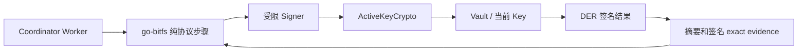
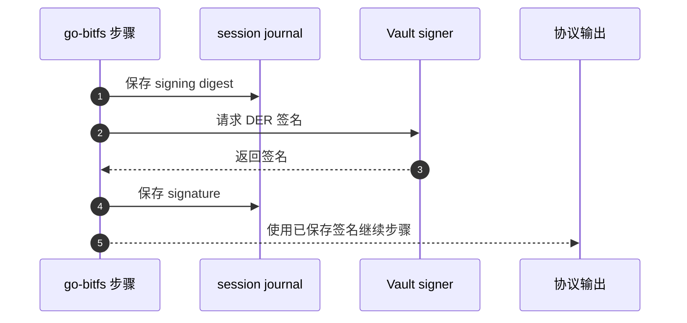

# 签名与证据

## 1. 私钥边界

BitFS 业务代码只接触受限的 `Signer` 和 32 字节摘要，不读取私钥字节。Coordinator 从当前 Vault 的 `ActiveKeyCrypto` 创建 signer；页面和 Window lane 不接收 signer、Provider 或私钥。



`createBitfsVaultSigner` 会：

- 固定创建时的压缩公钥；
- 只接受 `wire_message` 或 `transaction` 用途；
- 只接受 32 字节摘要；
- 每次签名前核对 active Key 没有变化；
- 要求 Vault 返回 DER 格式签名。

代码入口：`packages/plugin-msfile/src/bitfs/sdk.ts:51-76`。

## 2. 各步骤的签名责任

| 步骤 | 主要签名者 | 用途 | 保存位置 |
| --- | --- | --- | --- |
| Kind 1 | 卖方 | 报价承诺 | 卖方 quote outbox、买卖双方 `kind1-quote` |
| Kind 2 | 买方 | 开池请求 | `kind2-sign-digest-*`、`kind2-signature-*`、exact Artifact |
| Kind 3 | 卖方 | 退款模板预签 | `kind3-opening-response` |
| Kind 4 | 买方签名已在 Kind 2 / Funding 证据中 | FundingTx 交付 | `kind4-funding-delivery`、`funding-transaction` |
| Kind 5 | 买方 | 内容授权 | `kind5-sign-digest-*`、`kind5-signature-*`、exact Artifact |
| Kind 6 | 卖方 | 内容交付承诺 | `kind6-content-delivery-<authorizationId>` |
| Kind 7 | 买方先签，卖方补签 | 池内累计付款状态 | 买方 `kind7-payment-*`；卖方 `latest-payment-transaction-*` |
| Kind 12 | 买方 | 最终关池请求 | `kind12-close-sign-digest`、`kind12-close-signature`、exact Artifact |
| Kind 13 | 卖方 | 完整关池交易 | `kind13-close-response`、`close-transaction` |
| Funding split / FundingTx | P2PKH 协议花费端口 | 普通余额和 opening output | 专款账本与 transaction outbox |

Kind 4 本身不是一个新的独立签名步骤；买方在开池和 FundingTx 证据阶段完成相应签名，卖方验证 Kind 4 中的 FundingTx 关系。Kind 7 的卖方补签交易是双方本地池状态，不会被当成一条 WOC 广播。

## 3. 买方签名日志

买方使用 `createJournaledBitfsBuyerSigner` 包装 SDK signer。对每一个签名请求，顺序固定为：



- `kind2`、`kind5`、`kind7-payment`、`kind12-close` 是四个签名族。
- Kind 5 的签名按摘要命名；Kind 7 的签名按 `PaymentAuthorizationID` 命名。
- 如果已经存在摘要但没有签名，恢复时直接失败，不再次调用 Vault。
- 如果已经存在签名但没有对应摘要，也直接失败。
- 同一签名族恢复时必须使用相同摘要和相同签名；不会用当前时间或新交易替换旧证据。
- 签名期间 owner、generation 或 session epoch 变化会中止步骤。

代码入口：`packages/plugin-msfile/src/bitfs/signerJournal.ts:8-69`。

## 4. 卖方的 persist-before-sign

卖方 SDK 不拥有 Keymaster journal；`sellerProtocol` 在调用签名步骤前显式保存输入和签名意图：

- Kind 7：先保存买方 Kind 7、`payment-signing` 状态和签名摘要，再取得卖方签名；完成后保存 `latest-payment-transaction-<authorizationId>`。
- Kind 12：先保存 Kind 12、`kind12-close-sign-digest` 和 `kind12-close-signature`，再生成 Kind 13 和完整交易。
- 重复 Kind 7 复用已保存双签交易；重复 Kind 12 复用已保存 Kind 13 和 close transaction。
- 只有 `kind13-close-response` 和 `close-transaction` 都完成回读后，卖方才把 Kind 13 返回给买方。

代码入口：`sellerProtocol.ts:246-267`、`sellerProtocol.ts:269-343`。

## 5. 会话 journal

`BitfsSessionJournal` 保存的是应用状态和证据索引，不把 SDK 对象序列化到存储中。

```text
sessions/<sessionId>.json
  role, ownerPublicKeyHex, counterpartyPublicKeyHex
  seedHashHex, generation, runtimeInstanceId
  phase, pendingTxid, pendingAuthorizationId
  deadlineUnixSeconds, failureCode, revision
  evidence[]

evidence/<sessionId>/<name>.bin
  exact Artifact / 配置 / 摘要 / 签名 / raw transaction
```

每条会话记录都绑定当前 Key、对端公钥、Seed Hash 和 generation。`update` 使用 revision 与存储 ETag 做 CAS；旧 Worker 的迟到更新会冲突，而不会覆盖新状态。

`putEvidence` 的行为是：

1. 以 create-only 方式保存 evidence 文件；
2. 回读并逐字节比较；
3. 以会话 revision 原子加入 evidence 名称；
4. 已有同名不同字节时拒绝替换。

代码入口：`sessionJournal.ts:122-245`。

## 6. 常见 evidence 名称

| Evidence | 用途 |
| --- | --- |
| `kind1-quote` | 已验签报价 exact bytes |
| `opening-configuration` | 开池金额、仲裁方、退款时限和费率 |
| `funding-transaction` | FundingTx raw bytes |
| `kind2-opening-request` | 买方开池请求 exact bytes |
| `kind3-opening-response` | 卖方预签 exact bytes |
| `kind4-funding-delivery` | FundingTx 交付证明 |
| `kind5-content-request-<id>` | 每轮买方内容授权 |
| `kind6-content-delivery-<id>` | 每轮卖方内容交付 |
| `kind7-payment-update-<id>` | 每轮买方付款更新 |
| `latest-payment-transaction-<id>` | 卖方保存的双签累计状态 |
| `kind12-close-binding` | 最新授权编号、序号和累计金额 |
| `kind12-close-request` | 买方最终关池请求 |
| `kind13-close-response` | 卖方完整关池响应 |
| `close-transaction` | 已验证的完整关池 raw transaction |
| `refund-transaction` | 已固定的到期退款 raw transaction |
| `purchase-manifest` | 不依赖过期报价的文件入库清单 |
| `download-plan` | 多卖家池预算和调度快照 |
| `hash-request-message-id` | 报价与真实 Channel 需求的关联 |
| `file-price-limit` | 用户为该文件设置的最高完整块价 |

签名摘要和签名使用带后缀的 evidence 名称，例如 `kind5-sign-digest-<digest>`、`kind7-payment-signature-<authorizationId>`。Kind 8–11 的名称虽然存在于 schema，但当前业务没有写入路径。

## 7. 交易 outbox 证据

协议 evidence 保存交易原文，专用 transaction journal 再保存广播恢复索引：

```text
transactions/<txid>.bin
transactions/<txid>.json
```

`txid` 必须由同一份 raw transaction 计算得到。同一 txid 不能绑定另一份字节；重试只读取这份原文。这个边界与 Artifact evidence 分开，避免把“消息已保存”和“交易已广播”混为一谈。

代码入口：`broadcast.ts:42-123`。

## 8. 内容验签和暂存

买方不会因为收到 Kind 6 就立即付款：

1. SDK 校验 Kind 1、Kind 5、Kind 6 的绑定、授权、Hash 和长度；
2. 买方把 Seed 或 Block 写入 create-only 暂存；
3. 暂存成功后才保存 Kind 7；
4. 同一路径发生重试时，若暂存字节不同则拒绝；
5. 全部内容完成后才把文件提交到正式 `/msfile/storage`。

共享计划的暂存路径按 Seed 归并，旧的单池会话仍使用按 session 的兼容路径。代码入口：`buyerProtocol.ts:898-1040`、`buyerProtocol.ts:1250-1305`。

## 9. 失败时的安全规则

- 签名摘要存在但签名缺失：不重签，保留会话等待人工/恢复处理。
- 同一 evidence 名称出现不同字节：拒绝替换。
- 当前 Key 在异步边界前变化：停止签名、发送和状态更新。
- 非规范 Wire Artifact：拒绝，不尝试猜测或修复。
- WOC txid 与本地 canonical txid 不一致：广播视为失败，不推进业务。
- 内容和签名证据已保存但网络结果未知：继续保留 exact bytes，并按 txid 或对应 Artifact 恢复，不生成第二份协议消息。
