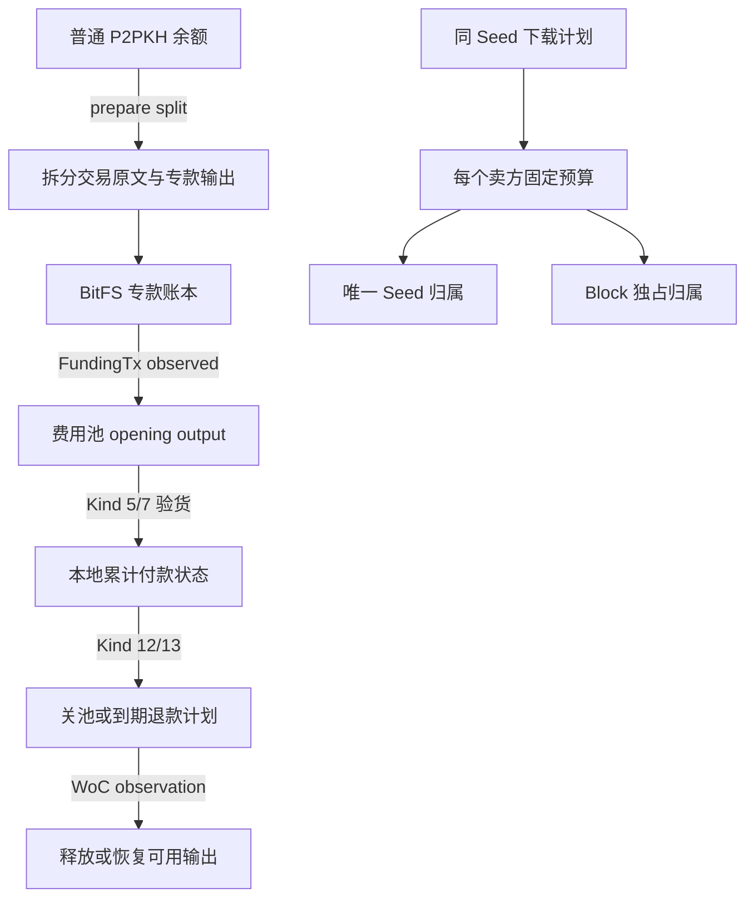
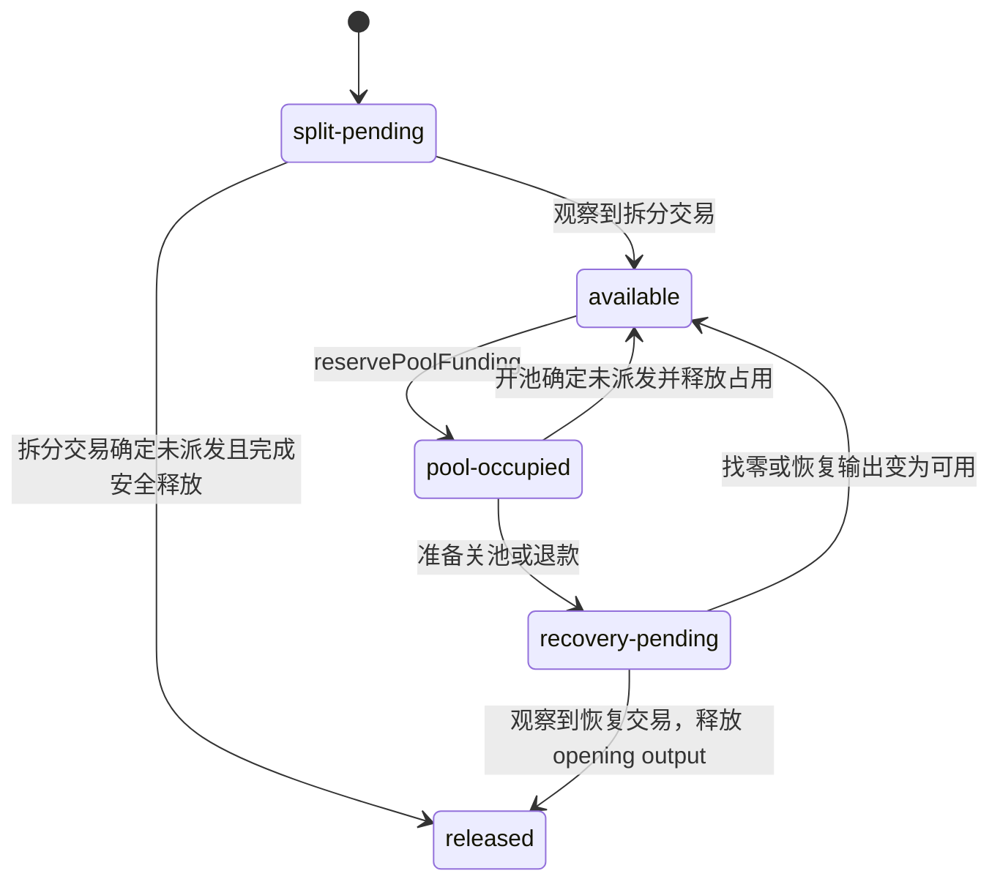
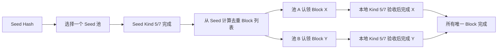

# 资金与账本

## 1. 资金不是一张总余额表

BitFS 购买同时维护四种不同职责的记录：

| 记录 | 作用 | 是否表示链上已收款 |
| --- | --- | --- |
| P2PKH 普通余额快照 | 为专款拆分选择普通 UTXO | 否，只是当前可花费输入视图 |
| BitFS 专款账本 | 保护专款、记录开池和回收状态 | 只有观察到交易后才会更新为可用 |
| 下载计划 | 记录一个文件由哪些卖方池购买、哪个 Block 归哪个池 | 否，是业务调度账 |
| 交易 outbox | 保存 exact raw transaction、txid 和广播结果 | `confirmed` 表示 WoC 接受或观察到，不表示出块 |



代码入口：`packages/plugin-msfile/src/bitfs/funding.ts:23-240`、`buyerDownloadPlan.ts:85-116`。

## 2. 持久化位置

相对于 `msfile` 的 `bitfs-journal` 专用 storage purpose，主要布局如下：

```text
sessions/<sessionId>.json
 evidence/<sessionId>/<evidenceName>.bin
funding/accounts/<main|test>/<seedHash>.json
transactions/<txid>.bin
transactions/<txid>.json
records/<requestHash>.json
outbox/<requestHash>.cbor
```

同 Seed 下载计划与 session、evidence、交易 outbox 一样位于 `bitfs-journal` 专用 storage purpose 的 `download-plans/<seedHash>.json`；共享暂存位于 MSFile 内容存储的 `bitfs-staging/by-seed/<seedHash>/seed.bin` 和 `bitfs-staging/by-seed/<seedHash>/blocks/<blockHash>.bin`。协议证据和资金状态不写入页面上传文件的元数据。

## 3. 从普通余额拆出专款

当用户开始下载且已有合格报价时，Worker 才准备专款。`prepareBitfsFundingSplit`：

1. 读取当前 Key 的新鲜普通 P2PKH 快照，过滤已经在内存池花费的输入。
2. 固定下一段预计采购金额 `requiredSatoshis`。
3. 用整数聪计算目标：

   ```text
   targetSatoshis = ceil(requiredSatoshis × 120 / 100)
   reserveSatoshis = targetSatoshis - requiredSatoshis
   ```

4. 通过 P2PKH `prepare` 取得交易预览和持久提交编号，但不调用 `submit`。
5. 先保护输入和预期输出，再把 exact raw transaction 写入交易 outbox。

因此 20% 是划拨余量，不是售价加成，也不是用户允许支付的最高金额。目标金额低于网络最小输出、快照不新鲜或输入已被占用时，拆分失败且不会广播。

代码入口：`funding.ts:703-708`、`funding.ts:764-910`。

## 4. 专款 UTXO 状态



上图只表示 `BitfsDedicatedUtxoState` 的五个值：`split-pending`、`available`、`pool-occupied`、`recovery-pending`、`released`。费用池自身另有 `funding-pending`、`funding-failed`、`open`、`recovery-pending` 和 `closed` 状态；观察到关池或退款后，费用池才会变为 `closed`。每个输出还记录来源 txid、vout、金额和锁定脚本。

### 4.1 开池

`reservePoolFunding` 只接受 `available` 的本文件专款，固定：

- 池编号；
- FundingTx canonical txid；
- 输入 outpoint；
- vout 为 0 的 opening output；
- 可选找零输出必须回到当前 Key；
- 最高手续费和找零规则。

在 FundingTx 被观察到之前，专款输入和 opening output 都保持保护；不会因为 Worker 重启而自动释放。

### 4.2 关池和退款

`preparePoolRecovery` 记录关池或退款交易的 spending outpoint、预期输出和 recovery txid。只有 `observePoolRecovery` 看到实际输入输出与计划一致后，才把池状态推进到 `closed`，并释放可恢复输出。

`result-unknown` 永远不是 `absent`。结果未知时继续保护输入和池输出，只按原 txid 对账。

## 5. 费用池预算

每个卖方池的预算在注册时固定，重试不能用不同价格、卖家或预算替换。共享计划的核心约束是：

```text
seedBudgetSatoshis + blockBudgetSatoshis = contentBudgetSatoshis
openingAmountSatoshis = contentBudgetSatoshis + feeReserve
```

其中 `feeReserve` 由当前矿工费率和一个固定倍数计算。新池的 `active` 只有在 FundingTx 被观察后才变为 true；关闭的池不能重新启用。

| 预算字段 | 含义 |
| --- | --- |
| `seedBudgetSatoshis` | 本池最多可支付的 Seed 金额 |
| `blockBudgetSatoshis` | 本池最多可支付的 Block 金额 |
| `contentBudgetSatoshis` | Seed 与 Block 预算之和 |
| `seedBudgetReserved` | Seed 报价为零时是否仍保留 Seed 预算授权 |
| `seedCommittedSatoshis` | 本池已由本地 Kind 5/7 验收的 Seed 金额 |
| `blockCommittedSatoshis` | 本池已由本地 Kind 5/7 验收的 Block 金额 |
| `committedSatoshis` | 本池累计已验收内容金额 |
| `inFlightBlockHashHex` | 本池当前唯一未完成 Block 认领 |

代码在 `buyerProtocol.ts:1324-1366` 校验预算证据，在 `buyerDownloadPlan.ts:258-323` 记账。

## 6. 多卖家计划如何避免重复付款



- `claimSeed` 只允许一个池成为 `seedOwnerSessionId`。
- `setBlockHashes` 在 Seed 付款验收前拒绝登记 Block 列表，并拒绝冲突清单。
- `claimNextBlock` 只选择没有其它认领的 Block；池的预算不足时不会继续领取。
- `completeSeed` 和 `completeBlock` 校验当前池归属、金额和池预算；重放相同付款是幂等的，金额不一致则失败。
- 取消先写文件级 stop fence；已签名的当前轮仍需按原路径结算，不能通过新请求绕过。
- 所有池都确认关闭后，未完成文件才允许显式恢复新的请求。

## 7. 普通余额为什么不会抢用 BitFS 输出

`listProtectedOutpoints` 会列出：

1. 所有尚未 `released` 的专款输出；
2. `prepared`、`result-unknown` 等尚未安全完成的专款交易输入；
3. 只有交易已观察且输入已被新鲜 P2PKH 快照确认不可花时，才解除输入保护。

普通 P2PKH 余额、协议花费和 BitFS 专款因此共享同一套 outpoint 保护边界。页面不直接选择这些 UTXO，所有准备和广播都经过 Worker 端口。

## 8. 如何理解“已付款”

在文档和 UI 中要区分三种说法：

| 说法 | 实际含义 |
| --- | --- |
| 已验货 | Kind 6 的内容已经通过 Hash、长度和内容校验，并可靠暂存 |
| 已签池内付款 | Kind 5/7 已保存，双方本地累计状态已完成；不代表该轮已广播 |
| 已广播/已对账 | 对应 FundingTx、关池交易或退款交易获得 WoC 接受或按 txid 观察到 |

下载计划的 `completeSeed` / `completeBlock` 只在第一、二种事实成立后记账；只有交易 observation 才会改变专款 UTXO 的链上可用性。

## 9. 失败时的资金原则

- 广播结果未知：保留 exact bytes、txid、输入保护和账本状态。
- 明确未派发：只有能证明没有进入 outbox 派发路径时，才允许释放预签 claim。
- 关池或退款未知：继续显示“待核对/受保护”，不把点击取消显示成资金已经回收。
- 锁定、切 Key、切存储或 generation 变化：迟到任务不能写入新会话；恢复完成前不允许创建新的买方资金会话。
