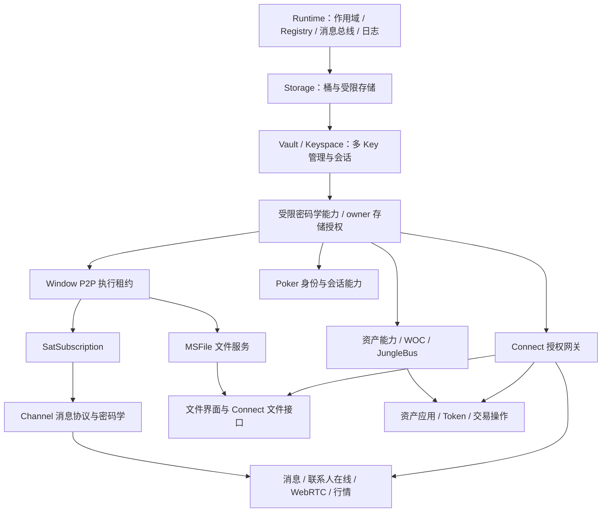
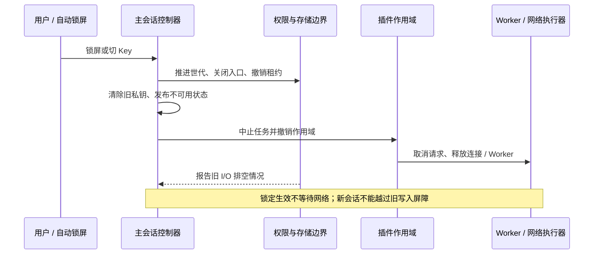

# Keymaster 插件系统重构设计：借鉴 Cordis，收口生命周期与权限

日期：2026-09-06。状态：施工中（核心跨环境链已验证；生产发布门禁未解除）。代码基线：工作区当前代码。

配套：[施工单](./implementation-plan.md)、[实际能力清单](./inventory.md)、[Cordis 验证记录](./cordis-spike.md)、[Connect 策略](./connect-strategy.md)。本文区分“已验证实现”和“生产前置条件”；未标为已验证的目标不能当作运行保证。

### 当前实施边界

- `packages/runtime` 已接入一套自研的薄生命周期核心：作用域、资源归属、同步撤权、服务桥契约、运行单元筛选、权限租约和升级 Session。它是当前施工适配层，不代表已经完成 Cordis 生产采用。
- SharedWorker 已持有插件产品意图的唯一写入控制面；页面 UI 提交带 `commandId`、`authorityInstanceId` 和 `expectedRevision` 的绝对命令，实例启动结果仍由本地 Host 单独报告。
- 当前 Web catalog 的 25 个产品均已在 manifest 与 contracts 静态目录中显式声明 Window 单元；需要跨环境的产品另声明 Coordinator Worker 单元。`pluginCatalog.ts` 只做精确契约校验，`workerUnitCatalog.ts` / `workerUnitRuntime.ts` 负责 Worker 单元目录和实际 instance 快照，不能把静态声明当成启动成功。
- 主页面的 Window → SharedWorker → 独立 MessagePort 服务桥 → owner/platform 存储与 Coordinator crypto 最终边界已经有 Node 与 Chromium 证据；服务端持有不透明 `grantId`，并校验连接身份、服务实例、会话 / 授权修订和最终 I/O。Dedicated Worker Session Crypto 也有独立浏览器证据。剩余生产门禁集中在目标部署 AppView、旧 Worker 退出、恢复演练、不可逆业务 I/O 全量审计和外部部署验证，不能据此直接生产切换。
- KMP-001 的 Cordis 实测结论是不在本批次引入未经浏览器 / Worker 验证的 Cordis 依赖，理由和命令输出见 [cordis-spike.md](./cordis-spike.md)。后续若采用 Cordis，必须另做适配器验证，不得与当前核心并行成为第二套调度器。

## 1. 设计结论

保留现有包划分、存储协议、密码学实现、MessageBus（消息总线）、Logger（日志服务）和 Resource Store（界面资源缓存）。将现有 Runtime 改造成一个管理**作用域、服务依赖、可撤销资源**的薄宿主。

施工入口曾要求优先验证 Cordis 核心。KMP-001 实测后，本批次暂不引入 Cordis：仓库没有现有依赖，隔离 Node 导入可用但尚未完成浏览器、Dedicated Worker 和 SharedWorker 构建 / 运行验证；当前自研薄核心已经覆盖所需最小语义。业务继续使用 Keymaster 的窄接口，不同时保留两套依赖调度器，也不引入插件市场、动态脚本加载、通用工作流引擎或另一套消息系统。Cordis 后续只能通过独立适配器验证后替换内部实现。

三个核心规则：

1. **资源跟随运行实例。** 锁屏、切 Key、禁用插件都由框架撤销对应作用域，插件只声明一次初始化和释放。
2. **权限跟随授权租约。** 存储、签名、网络请求都使用绑定身份与世代的句柄，不能在切 Key 后自动变成另一把 Key 的句柄。
3. **数据跟随持久归属。** 删除 Key 走现有可恢复删除流程；不依赖插件是否启用，也不等待消息订阅者“自行删干净”。

“精简”的验收不是新接口少了几个字段，而是删掉业务中的重复锁屏监听、重复任务恢复和全局清理清单，并且原有安全栅栏仍然有效。

## 2. 当前系统到底是什么关系

### 2.1 已有能力与问题证据

以下路径均相对于仓库根目录。

| 模块 / 证据 | 已有能力 | 本次需要解决的边界 |
| --- | --- | --- |
| `packages/runtime/src/createPluginHost.ts`：`createContext`、`disable` | 依赖检查、`onDispose`（注册释放回调）、配置、能力与界面注册回收 | 禁用仍被反向依赖阻止；通用 `get` 可读取全局能力；缺少完整的会话实例生命周期 |
| `packages/runtime/src/pluginOwnership.ts` | 装配前后快照差分确定资源归属 | 很难覆盖装配完成后的异步注册；归属字段随 Registry 类型增加 |
| `apps/web/src/bootstrapPlugins.ts`、`pluginCatalog.ts` | 四个启动阶段、插件专属 Coordinator 接口 | 清单顺序、阶段、依赖图与 Worker 内装配同时承担启动管理 |
| `apps/web/src/keymasterSessionCoordinator.worker.ts` | 主会话私钥、世代检查、任务调度、存储授权、MSFile、Sat、Channel | 约 8,041 行，多个业务运行时在同一文件手工启动与释放 |
| 同文件：`performGlobalLock`、`transitionActiveStorageOwner` | 已有先撤权后清理、旧写入排空、切换失败不复活旧世代 | 应提取为唯一会话边界，不能用 Cordis 的普通卸载直接替代 |
| 同文件：`executeKeyDeletionTransaction` | 删除日志、分阶段恢复、删除 Key 与附属凭据 | 保留并补齐平台目录中的 owner 引用、跨会话授权与任务归属 |
| `packages/platform-storage/src/storage-access/platform-root/platformRootStore.ts` | owner 删除标记、操作排空、对象与 schema 清理、重导入世代 | 已有防迟到写入能力；不重新发明删除框架 |
| `packages/contracts/src/activeKeyCrypto.ts` | 操作式私钥能力，不直接暴露私钥字节 | 签名、身份、加密备份导出仍在一个能力对象中，权限粒度偏粗 |
| `packages/contracts/src/storage/access.ts`、`storage/systemStorageDeclarations.ts` | 桶、owner、App 目录隔离及内置插件授权表 | 继续作为存储权限基础；扩展读写动作与撤权生命周期 |
| `packages/runtime/src/messageBus.ts`、`log/logService.ts` | 统一消息总线、带插件身份的 logger | `publish` 不等待异步监听者，不能作为删除完成或停机完成屏障 |
| `packages/plugin-token-bsv21/src/manifest.ts`、`plugin-p2pkh/src/p2pkhService.ts` 等 | 解锁、切 Key、删除后的刷新与缓存回收 | 多个业务重复处理同一生命周期，是主要迁移对象 |

源码阅读发现的是架构问题和需要验证的风险，不代表上述每个路径已经有可复现的线上故障。本轮已运行主 Coordinator、存储 / 密码学、生命周期及 Chromium 主链回归；未把这些结果外推为全部业务生产验收。

### 2.2 不止一个 Worker，不能用一个“全局 unlocked”概括

| 执行位置 | 当前职责 | 目标边界 |
| --- | --- | --- |
| 主 Coordinator SharedWorker（共享 Worker） | 多个主页面共享私钥会话、任务、存储与服务运行时 | 主会话唯一权威；重启后保持锁定；不因某个页面关闭而销毁 |
| 主页面 Window（窗口） | 插件 UI、资源投影、用户交互、部分浏览器网络执行 | 只持有受限代理；页面关闭只清理该页面资源 |
| Connect Session Window（第三方会话窗口）及其专用 Worker 路径 | 协议会话与密码学能力执行 | 独立实例、独立关闭与撤权；不冒充主 Coordinator |
| Window P2P executor（浏览器网络执行器） | 浏览器环境中的 P2P Host 和网络 lane（通道） | 沿用唯一执行租约，MSFile 与 Sat 复用，避免每个 Tab 建连接 |
| MSFile 媒体 Worker / Service Worker | 解复用、转封装、媒体读取桥接 | 生命周期属于媒体请求或页面；授权属于对应 owner 会话 |

**Connect 存在实现路径差异，必须记录而不是靠文件名推断：**

- `plugin-vault/src/sessionCryptoClient.ts` 的 `mode: appview` 可创建 `sessionCryptoWorker.ts`；后者有私钥字节状态。本批次已用应用 Worker 工厂完成 Dedicated Worker 浏览器回归，但该路径仍不是所有 Connect 请求的默认持钥路径。
- 当前 `plugin-vault/src/manifest.ts` 使用 `createVaultServiceCoordinator`；其 `createAppViewSession` 返回 Coordinator 密码学代理。实际 AppView 交接由 launcher 预开 Session Window，再将受控 bootstrap runtime 交给 Session Window。
- `plugin-protocol/src/protocolService.ts` 的 AppView 生产路径已用真实 `/apps → Session Window → 外部 AppView → connect.launch` Chromium 回归验证；它仍执行来源、App 身份、session、owner 和启动令牌校验，不应被解释成第三方页面持有主私钥。

因此目前不能宣称“所有 Connect 操作都由独立 Worker 持钥”，也不能宣称“所有 Connect 会话都独立于主会话”。施工必须追踪生产入口和实际交接对象，用浏览器测试确定路径，再清理没有生产调用者的旧实现。

### 2.3 实际分层是能力图，不是一条长链

当前 manifest 中的重要依赖如下。这里省略通用 UI Registry，且“声明缺失”不代表实际运行没有依赖：

| 当前消费者 | 当前声明 / 实际装配关系 | 需要澄清的地方 |
| --- | --- | --- |
| Vault | manifest 没有声明服务依赖；实际由 Storage bootstrap 注入 Key 仓库 | 存储前置条件隐藏在 Worker 装配中 |
| MSFile、SatSubscription | 都声明依赖 Window P2P executor | 二者是共享网络底座上的分支，不是 MSFile → Sat 链条 |
| Sat / Channel | Sat manifest 提供 Channel capability；Worker 内创建 Channel 运行时 | 展示插件、传输服务和消息协议当前混在一个提供关系中 |
| WebRTC | Channel、Keyspace、Contacts | Contacts 用于校验可进入传输确认的联系人 |
| Message | Channel、Keyspace、WebRTC、联系人操作注册表 | 文本消息当前对 WebRTC 是硬依赖，目标可拆局部可选功能 |
| BsvPrice | Channel、Keyspace | 行情不是所有应用的底层前置服务 |
| P2PKH | Vault、Keyspace、WOC、受保护 outpoint 注册表 | 与 Worker 内独立创建的支付支持不是同一层依赖 |
| BSV21 / STAS / 1Sat | P2PKH、对应 WOC 能力、Keyspace、后台与通知能力等 | 业务层和 Worker 任务层都有依赖关系，需要合并描述 |
| Poker | Vault、Keyspace、MessageBus | 当前清单没有 Channel 硬依赖，本次不凭空增加 |
| Protocol、Apps | Protocol 依赖 Vault / Keyspace；Apps 依赖 Protocol | 网关入口可常驻，获准执行的 App 会话另有生命周期 |
| Home | Keyspace、Contacts、联系人操作注册表等 | 必需界面与业务服务耦合，需要拆局部贡献 |

下面是据此整理的目标能力关系：

此图表达目标运行时能力方向，不表示每个页面插件都应该直接依赖图中全部模块。

- Logger 和 MessageBus 是基础设施，不排在 MSFile 后面。日志持久化是可延后绑定的输出端，避免“启动失败需要日志、日志又等存储启动”的环。
- MSFile 是系统服务，但不是所有应用的前置依赖。Sat / Channel 是另一条共享网络分支。
- 当前 Sat 内部还有 P2PKH 支付支持；应抽出稳定的支付能力供系统服务使用，避免“系统订阅服务必须依赖可禁用的资产页面”。先复用原实现，不重写支付逻辑。
- `plugin-protocol` 是可信的 Connect 网关；`packages/connect` 是外部 App SDK。第三方 App 不进入内部插件的 `ctx.get` 服务容器。
- Registry（注册表）是宿主能力，不是设置页、首页等 UI 插件本身。底层模块注册设置入口，不意味着底层运行时依赖设置页。

## 3. Cordis 用在哪里，不能替我们做什么

Cordis 的服务依赖与可逆副作用适合解决“服务出现就装配、服务消失就释放”的问题；有严格释放顺序的资源仍需集中编排。参考其上游入口指向的[核心概念说明](https://deepseek-harness.github.io/deepseek-harness/reference/cordis-primer)。

| Cordis 概念 | Keymaster 中的对应 | 采用范围 |
| --- | --- | --- |
| Context（上下文） | 一次插件运行可访问的能力环境 | 内部使用；对业务暴露经过授权过滤的接口 |
| Inject（服务依赖） | `dependencies` 声明的能力 | 取代手写启动顺序与依赖缺失重试逻辑 |
| Fiber（运行实例） | 某作用域内的一次插件实例 | 与持久插件配置分离，可销毁和重建 |
| Effect（可撤销副作用） | 定时器、监听、任务、Worker、注册项 | 创建时同时登记释放行为 |
| Service（服务） | 现有 capability（能力） | 沿用契约与业务实现，不要求全项目改成类继承 |

KMP-001 记录的可安装包为 `cordis@4.0.0-rc.9`；隔离 Node 导入和 `new Context()` 成功，但仓库没有锁定依赖，也未完成浏览器、Dedicated Worker、SharedWorker 构建 / 运行验证。该结果不满足“采用 Cordis”门槛。依据：[上游仓库](https://github.com/cordiverse/cordis)、[包描述](https://github.com/cordiverse/cordis/blob/main/packages/core/package.json)、[验证记录](./cordis-spike.md)。

还要注意，上游 `Fiber` 的卸载实现会并行处理部分释放回调，并记录部分清理异常。因此不能推断“await dispose 成功 = 所有远程资源已释放 = 数据事务完成”。Keymaster 必须自己拥有安全撤权、写入排空和结构化清理结果。依据：[Fiber 源码](https://github.com/cordiverse/cordis/blob/main/packages/core/src/fiber.ts)。

以下能力由 Keymaster 保留：跨 Worker RPC（远程调用）、多 Tab 权威、存储隔离、权限审批、私钥保管、不可逆请求处理、删除日志和崩溃恢复。Context 隔离不是恶意代码沙箱。

因此当前选择“借鉴语义并增强现有 Host”的最小实现，保留跨环境服务桥、权限、存储世代和安全撤权在 Keymaster 自己的边界内。这个选择不解除真实服务桥和最终 I/O 授权门禁；它只避免在证据不足时增加另一套框架依赖。

## 4. 最小框架模型

### 4.1 只引入必要的作用域

| 作用域 | 存活条件 | 主要资源 |
| --- | --- | --- |
| `root`（执行环境根） | 当前 Worker / 页面存在 | 日志、总线、注册表、管理入口 |
| `storage`（当前桶绑定） | 存储配置与 Provider 有效 | 桶访问、Vault 仓库、删除恢复；换桶即重建 |
| `owner-session`（当前 Key 的一次授权会话） | 已解锁、owner 就绪、存储可用 | 私钥租约、owner 存储、系统服务、后台任务 |
| `plugin-instance`（插件运行实例） | 用户启用且依赖、权限就绪 | 插件服务、子任务、注册项 |
| `request`（单次请求） | 操作尚未结束 | 网络请求、流、临时对象、超时控制 |
| `connect-session`（第三方授权会话） | 会话与对应授权有效 | Connect 请求、订阅、专用 Worker / 代理 |

这不是六套管理器：使用同一作用域原语，分别由主 Worker、页面和 Connect 所在环境持有本地实例。跨环境传递服务目录快照、受限 RPC 请求 / 响应与撤权消息，不传 Context 对象；具体桥接约定见 4.4 节。

普通业务的 owner 运行单元放入 `owner-session`；Vault、Storage、系统诊断、Connect 入口保留管理外壳，只有会话业务部分作为子实例重建。避免给所有插件强制增加两套入口。界面处于锁定态时由宿主提供统一占位，不保留旧 owner 数据。

### 4.2 产品、运行单元和状态分开描述

包是代码组织方式，产品是用户启停单位，运行单元是装配描述，实例是它在某个作用域中的一次运行。原稿把这些层次压在一张字段表里，容易误读为“一个包只有一个 execution / lifetime”，这里明确修正。

**静态描述**采用两层，但不另建第二份插件目录：`packages/contracts/src/pluginProducts.ts` 是产品和运行单元的唯一描述源；`apps/web/src/pluginCatalog.ts` 只是可执行 manifest 入口清单并逐项校验该契约，`apps/web/src/coordinator/workerUnitCatalog.ts` 只补充真实 Worker 的 task/service/I/O 归属，也必须从该契约物化（materialize）。现有 manifest 演进为 `PluginDescriptor`（插件产品描述），包含稳定产品 `id`（标识）、展示元数据、允许禁用规则和 `units`（运行单元列表）。`RuntimeUnitDescriptor`（运行单元描述）中的字段如下；名称是目标契约，并非当前 API。

| 字段 | 中文含义与约束 |
| --- | --- |
| `id` | 稳定运行单元标识，例如 `p2pkh.worker`、`p2pkh.window`；不是运行实例 ID |
| `execution` | 执行环境：`coordinator-worker`（主共享 Worker）、`window`（窗口）、`connect-worker`（Connect 专用 Worker） |
| `lifetime` | 依附哪种作用域：常驻管理、存储、owner 会话或 Connect 会话；单请求由实例派生 |
| `dependencies` | 所需服务及契约版本；跨环境依赖明确写出服务来源，禁止静默退回同名本地服务 |
| `provides` | 提供的服务；由原 `providesCapabilities` 演进，不保留两份独立维护的服务清单 |
| `permissions` | 本运行单元申请的权限；不等于已批准权限 |
| `storage`、`business`、`config` | 分别为存储声明、界面贡献、配置契约与部署默认值；放在使用它们的单元上。可变的用户配置值属于持久意图，不反写静态描述 |

同一个包可导出多个单元，简单插件只声明一个。纯描述与各执行环境的实现入口分开导出，Worker 不导入 React。代码中由 `RuntimeUnitImplementationRegistry`（运行单元实现注册表）按 `productId + unitId` 提供当前环境入口；Window 现有 product-level `setup` 仅由装配适配器登记，Host 的生产路径不再直接回退读取它，Worker 也不会因 Window 有实现而自动获得同名入口。Connect 网关通常调用已有 Worker 服务，不要求每个业务包都额外写一个 Connect 单元。

例如 P2PKH 产品有一个 Worker 资产单元和一个依赖远程资产服务的 Window 单元。三个 Tab 对应一个 Worker 实例和三个 Window 实例。关闭一个 Tab 只释放其 Window 实例；停用产品则让其所有单元停止，并让跨产品依赖者等待。系统支付原语如必须常驻，仍属于独立内核服务，不能暗藏在这个可禁用产品内。

**另外三种数据不放进静态描述：**

| 数据 | 真值所有者 | 内容 |
| --- | --- | --- |
| 可信授权策略 | 内置装配策略 / Connect 授权仓库 | 批准的动作与范围、策略或授权修订；见 7.3 节 |
| 持久用户意图 | 主 Coordinator 控制面 | 产品级 `desiredEnabled`（希望启用）、配置及 `desiredRevision`（该产品意图修订）；兼容原布尔启停配置 |
| 运行快照 | 实例所在环境 | `unitId`（单元标识）、`instanceId`（实例标识）、`state`（运行状态）、`blockedBy`（阻塞原因）、清理结果与修订号 |

依赖和服务声明来自单元描述；产品依赖展示由单元图归纳，不手写另一张图。内置存储授权继续使用 `SYSTEM_STORAGE_DECLARATIONS`，通过校验映射到对应单元，不能凭拆出新单元获得更宽目录权限。

主 Worker 管理系统产品意图和自己的实例，页面依照意图投影管理本地实例；本地 UI 初始化错误不能改写主 Worker 的运行状态。产品页展示“后台运行、此页面失败”等聚合结果，不以一个 enabled 布尔值掩盖不同实例。

### 4.3 资源创建必须带归属

框架统一承接：服务提供、Registry 注册、消息订阅、定时器、后台任务、AbortController（取消控制器）、MessagePort（消息端口）、Worker、网络 lane、流和对象 URL。

- 创建时绑定 `instanceId`（实例标识）与释放回调，不能再依靠装配前后快照推断归属。
- 初始化失败也释放已登记资源；停止期间禁止新注册。异步创建在停止后才返回时，立即释放返回资源，不能挂到新实例。
- 释放幂等；一个回调失败，其他回调继续执行。框架记录待排空资源和错误，不伪装为完全清理成功。
- 正常卸载先停止消费者，再释放提供者；有严格关系的资源使用一个显式释放链。安全撤权不等待这条链。
- 业务保留领域判断，例如余额是否足够、供应商是否可用；不再写“锁屏就 stop、解锁就 start”的通用逻辑。

### 4.4 远程服务桥：把已就绪代理提供给本地 Cordis

Cordis 仅管理本地实例。Keymaster 在现有 Coordinator RPC 和 topic snapshot（主题快照）基础上增加一层统一服务桥，不建设自动网络寻址或跨进程 Context。当前实际使用的是 `packages/runtime/src/lifecycle/` 的自研薄桥：它负责服务目录、代理失效和连接状态；本地依赖调度仍由 Host 处理。Cordis 暂不进入生产依赖。

**远程服务引用**的最小字段如下。引用用于定位和校验，不是持有即获权的授权凭据。

| 字段 | 中文含义与比较规则 |
| --- | --- |
| `capabilityId` | 服务契约标识，在指定提供环境及作用域内解析 |
| `providerInstanceId` | 此次提供服务的运行实例；每次重建必须不同 |
| `execution` | 实际提供者执行环境，不是消费者的位置 |
| `contractVersion` | 接口契约版本；第一阶段要求精确匹配，不自动猜测兼容性 |
| `authorityInstanceId` | 当前提供环境的启动身份；Worker 重启后改变，区分修订号重新计数 |
| `scopeId` | 服务所属作用域实例；区分不同窗口、Connect 会话和多个 owner 作用域 |
| `sessionEpoch` | owner / Connect 会话世代；常驻无会话服务显式为 null，不使用虚构的解锁世代 |
| `ownerPublicKeyHex`、`ownerGeneration` | owner 公钥与持久 owner 存储世代；非 owner 服务为 null。后者不代替 Key 切换世代 |
| `status` | 提供者报告的 `starting`（启动中）、`ready`（就绪）、`unavailable`（已不可用）、`failed`（启动失败） |
| `snapshotRevision` | 当前权威服务目录流的单调修订号，只在同一启动身份和订阅范围内比较 |

授权租约另带桶绑定、现有 Key 切换世代和授权修订等限制，不能因为引用表未列出这些字段而删除已有校验。

**握手、订阅与就绪：**

1. 客户端先在绑定端口上完成版本握手，得到权威启动身份；以本次连接标识过滤旧端口和旧握手回包，不能让迟到消息重新选择旧 authority。
2. 订阅先安装事件接收，再获取该订阅范围的一致全量基线与修订号，缓冲并接续之后的事件。复用现有 baseline 机制；检测到缺口则撤下相关代理，重新同步基线。
3. 提供者完成初始化、本地数据恢复及 RPC handler（请求处理器）安装，确认启动令牌仍有效后，才发布 `ready`。manifest 声明存在、Worker 已连接都不算服务就绪。
4. 桥同时验证服务引用、版本、作用域和授权，才在消费者本地 Context 提供受限代理。Cordis 看到这个本地服务出现，才装配消费者。

**撤销与恢复：** 提供者先拒绝旧实例的新调用，再发布不可用；桥撤下本地服务，消费者按依赖规则停止。提供者重建发新实例引用，桥创建新代理；旧代理永久失效，不能原地换绑新实例。服务恢复后，仅希望启用且满足条件的消费者重建，重建规则见第 6 节和 6.1 节。

**RPC 请求与响应：** 业务请求可以携带 `operationId`（业务幂等编号），但 MessagePort 传输层另行生成连接内唯一的 `callId`（传输关联编号）关联响应；不能用调用方可复用的业务编号做传输关联。服务端在接收、敏感操作提交前核对提供者实例、连接身份、服务端 `grantId` 及授权世代；客户端在接受结果时再次核对请求所属连接、引用和消费者启动令牌。已排队但不再匹配的调用拒绝，旧调用不能迁移到新提供者执行。桥不自动重放具有外部副作用的请求。

当前实现证据：`apps/web/src/keymasterSessionCoordinator.worker.ts` 通过独立服务端点持有服务授权，`apps/web/src/keymasterSessionCoordinatorClient.ts` 使用独立 MessagePort，`packages/runtime/src/lifecycle/messagePortServiceTransport.ts` 生成 `callId`；`packages/platform-storage/src/coordinator/storageBindingAuthority.ts` 在远端授权检查未进入物理 I/O 时只重绑一次 platform grant。Node Coordinator 测试和 Chromium 生产构建 E2E 均覆盖这条主链。

**乱序与故障规则：**

| 情况 | 本地处理 |
| --- | --- |
| 同一目录流收到小于或等于已接受 revision 的快照 | 丢弃；不同启动身份的 revision 不互相比较 |
| 收到不属于当前握手绑定启动身份 / 连接的消息 | 丢弃；新启动身份只能经新握手接受，并先使旧代理失效 |
| 连接断开、握手未完成、目录出现修订缺口 | 服务桥不可用，消费者停止后进入 `waiting`（等待）；保留用户意图 |
| 单次业务 RPC 超时 | 当前请求失败；除非连接 / 服务失效，不因此卸载整个插件 |
| 提供者报告失败 | 消费者等待并显示上游失败原因；失败属于提供者实例 |
| 契约版本不匹配 | 拒绝提供代理，消费者等待“版本不兼容”；停止针对同一不兼容版本的无效重连 |
| 消费者自己的初始化抛错 | 该单元进入失败流程，不归咎于远程连接 |

每个服务目录流明确只有一个序列分配者，不把无关 topic 的 revision 拼成一个序列。断线被检测前或窗口暂停期间，通知可能延迟，因此安全依赖服务端逐次校验，不以“窗口已经收到撤权通知”作为安全前提。

## 5. 锁屏、切 Key、解锁：唯一控制面

### 5.1 世代与句柄

继续使用现有 `sessionEpoch`（会话世代）、`keyspaceGeneration`（Key 切换世代）、`bucketGeneration`（桶世代）、owner 存储世代及根安装令牌；第一阶段不合并或删掉防护字段。各自解决不同的旧引用问题。

业务只看到框架绑定好的句柄与取消信号。内部至少绑定：插件身份、运行实例、owner、公钥会话世代、存储世代；Connect 另绑定会话身份和来源。权限所有者由已绑定端口/授权表确定，不信任请求里自报的 `pluginId`（插件标识）。

核心约束：**旧句柄永不自动换绑新 owner。** 即使 A → B → A，也必须发新句柄。框架可以重建插件并发新句柄，不能让旧 Promise 恢复后借用 B 或新 A 的权限。

### 5.2 两段式停止

第一段为安全停止：不等待业务和网络，先撤权、推进世代、清除旧私钥引用、取消定时器和任务，通知页面隐藏旧数据。沿用当前 `performGlobalLock` 的原则。JavaScript 内存清零是尽力释放，不声称可以擦除所有引擎内部副本。

第二段为资源收尾：框架等待必要的存储写入排空，并限时处理退订、关闭和任务结束。超时仍保持锁定及旧 owner 栅栏，显示“已锁定，清理未完成”。不能因清理报错恢复旧授权。

已提交给远端的写入、广播或扣费无法靠 AbortSignal 撤回。远端副作用结果未知时保留现有意图 / 交易记录；后续查询确认，不把本地取消显示成远端撤销。超时后的旧存储写入未被证明排空之前，禁止删除完成、重新导入同 owner 或重新开放其写权限。

### 5.3 控制操作的顺序

保留 Coordinator 的控制操作串行机制。锁屏的即时撤权不能排在无限期网络请求后面；长操作必须在返回或提交前重验世代。主会话控制器只负责状态与安全边界，不直接列举每个业务服务的 stop 方法。

| 触发 | 框架行为 | 恢复条件 |
| --- | --- | --- |
| 锁屏 | 撤销当前 owner 会话，保留 Storage / Vault 管理外壳 | 再次验证解锁，确认排空，创建全新实例 |
| A 切 B | 验证目标、撤销 A、排空 A 写入、激活 B | B 初始化完成后再公开 B 服务 |
| 切换失败 | 已越过撤权点则进入锁定 / 无活动会话 | 不复活 A 的旧句柄或旧世代；重新认证建立新会话 |
| 解锁 | 读取持久配置，装配依赖满足的 owner 插件 | 重建实例，完成本地数据恢复，再启动必要同步 |
| 换桶 / 存储故障 | 撤销存储子树和对应 owner 授权 | 恢复桶并完成删除日志恢复后再解锁 |
| 主 Worker 重启 | 丢弃旧租约、保持锁定 | 页面重新获取快照；不从缓存恢复私钥 |

准备目标时的短期密钥材料也必须归属于受控过渡操作，失败即释放。锁屏后旧初始化不能发布服务。

### 5.4 “重新执行”具体指什么

| 任务类别 | 解锁 / 依赖恢复后的默认行为 |
| --- | --- |
| 周期同步、余额观察、联系人在线探测 | 每次实例创建最多触发一次恢复运行，再按原周期调度；错过的多次 tick 合并 |
| 本地数据恢复 | 先完成一次读取再发布服务就绪；作为消费者依赖，替代各插件互相等事件 |
| 文件上传 / 下载 | 按已有 checkpoint（进度检查点）和授权校验恢复；无可靠断点则明确重新开始 |
| 转账、广播、消息发送、付费读取、审批中的请求 | 不自动重放；先核实已提交结果，必要时重新确认 |
| WebRTC 通话、摄像头、屏幕共享 | 停止并释放媒体轨道；解锁不自动再次呼叫或启动采集 |
| 用户显式停用的插件 | 保持停用，不因解锁或依赖恢复启动 |

后台调度器是 Worker 内核能力，`plugin-background` 是它的管理 UI。任务归属其业务插件实例，而不是页面。锁屏撤销当前运行，解锁由一次实例装配恢复，删除业务中的重复 `vault.unlocked` 任务触发。

### 5.5 哪些清理需要跨重启恢复

框架负责实例释放，领域仓库负责仍有外部后果的收尾；不把每个 disposer（释放函数）序列化成通用任务。

| 清理类型 | 是否持久恢复 | 负责人 |
| --- | --- | --- |
| 定时器、事件监听、页面对象 URL、本地 Worker | 否；所在环境退出后资源自然消失，仍存活的页面在断线时释放 | 本地作用域 |
| 服务端连接绑定的订阅 | 协议明确断连失效或租约到期即可；验证该保证，不重复登记无意义的退订任务 | Sat / Connect 协议适配器 |
| 断连后仍保留的远端订阅、分片上传 | 是，记录远端句柄与幂等撤销意图 | 对应协议 / multipart 仓库 |
| 已提交但结果未知的广播、支付 | 是，沿用交易 / 支付意图记录，重启先查询事实 | 交易 / 支付服务；不能重放为新付款 |
| Key 删除 | 是，沿用删除日志及 owner 封锁 | 删除协调器与 Storage |

持久记录至少包含 `operationId`（稳定操作 / 幂等标识）、`kind`（领域动作）、`ownerBinding`（原桶、owner 与世代）、`remoteRef`（远端句柄）、`phase`（进度）、`attempts`（尝试次数）、`nextAttemptAt`（下次重试时间）及 `lastErrorCode`（最近错误）。优先补充现有记录，不另存一份同样状态；远端不支持幂等时必须查询或转人工处理，不能仅凭本地幂等键声称远端只执行一次。

会留下持久外部资源的创建意图要在发出操作前落盘；远端响应丢失时靠原操作标识查询，不能只在 dispose 报错后才记录。已关闭的 owner 作用域不负责自己的持久重试，由存储可用时挂载的领域恢复单元执行，复用同一内核调度器，使用有上限的退避。插件停用不阻止已批准的撤销 / 查询收尾，但恢复单元没有新建订阅、签名或付款权限。

凭据或认证不足时进入等待认证；不可判定的远端结果进入待人工核实。重启恢复不能偷偷解锁，也不能把旧 Key 的工作换绑新 Key。删除关键记录前，须完成阻塞删除的收尾，或将必要的非秘密恢复依据保留在受控平台仓库；不能删掉恢复依据后再宣称任务会重试。存储故障导致意图无法落盘时，拒绝开始新的相关外部操作；已有未知结果明确报告，不能承诺自动恢复。

## 6. 禁用插件：自动停依赖者，保留用户意图

例如 P2PKH 提供资产能力，BSV21、STAS、1Sat 依赖它：

1. 用户禁用 P2PKH，仅将 P2PKH 的 `desiredEnabled` 设为 false。
2. 依赖者先撤权和停止，状态显示“等待依赖 P2PKH”；其启用配置不变。
3. 最后释放 P2PKH，取消 Worker 内对应任务、页面资源和相关请求。
4. P2PKH 恢复后，仍希望启用的消费者按依赖图重新装配；此前手动停用的消费者不启动。

这里“自动 disable”指有效运行状态自动停用，不是批量改写用户设置。禁用不删除持久数据。

- 单一服务默认只有一个提供者；重复提供、硬依赖环在装配前报错，展示中文依赖链。
- WOC / JungleBus 等多 Provider 场景保留专门 Registry 和显式选择，不按装配顺序抢占服务名。
- 可选功能用子插件 / 局部依赖作用域，例如消息页的 WebRTC 操作可以暂不可用，而文本消息服务继续运行。不能用一次 `has()` 探测充当动态依赖管理。
- 常驻必需管理外壳不能硬依赖可禁用业务，否则拒绝该配置，或先将依赖改成局部可选贡献。
- 当前页面受影响时，宿主撤销旧数据和操作入口，跳到安全页或显示统一不可用页。
- 系统启停由主 Worker 接收、持久化并推进配置修订号，再广播权威结果。多 Tab 不各自写入并执行相互冲突的启停链；停止中的反向启用要等旧实例安全收尾。
- 初始化失败进入明确失败状态，等待用户重试或依赖版本变化后的受控重试；不无限自动重启，不在失败时继续提供半成品服务。

### 6.1 运行状态与并发命令

状态表示**一个运行单元在一个具体作用域位置上的状态**。它不是产品启用意图，也不是 Cordis 内部枚举的直接复制。每次启动分配新 `instanceId`，停止后的旧实例永不复用；`waiting` / `disabled` 时可以没有活动实例。

| 当前状态 | 事件 / 条件 | 转换及动作 |
| --- | --- | --- |
| `disabled`（用户停用） | 启用意图已持久化 | 条件满足则 `starting`，否则 `waiting` |
| `waiting`（等待运行条件） | 依赖、授权和作用域就绪 | 创建新实例，进入 `starting` |
| `waiting` | 用户停用 | `disabled`，不启动再销毁一次 |
| `starting`（正在初始化） | 当前启动令牌有效，初始化完成 | 发布服务并进入 `running` |
| `starting` / `running`（运行中） | 停用、配置变更、锁屏、依赖撤销或授权变化 | 立即撤权，进入 `stopping`；记录最新意图，不能直接换绑 |
| `starting` / `running` | 当前实例初始化失败 / 致命运行错误 | 进入 `stopping` 清理，记录本次失败；普通业务请求失败不属于此类 |
| `stopping`（停止与排空中） | 再次启用、配置更新或提供者恢复 | 只更新待协调的最新目标；旧清理继续，不并发创建替代实例 |
| `stopping` | 释放完成，或残余资源已证明安全隔离并转交领域恢复 | 按最新意图进入 `disabled`、`waiting` 或 `failed`；需要运行则再创建新实例进入 `starting` |
| `stopping` | 排他资源 / 存储写入未能排空 | 保持 `stopping` 并报告清理问题；不能仅靠超时宣称已隔离 |
| `failed`（本单元失败，旧实例已安全退出） | 显式重试或相关配置 / 依赖实例实质改变 | 条件满足时创建新实例；同一启动输入指纹自动重试最多一次，不因重复快照循环重试 |
| `failed` | 用户停用 | `disabled` |

每个异步初始化、业务结果发布和状态提交都携带并校验 `instanceId + desiredRevision + sessionEpoch`（实例标识 + 本产品意图修订 + 会话世代）；非会话实例的世代明确为 null。另核对捕获的依赖提供者实例和授权版本。任一失效只清理自己的资源，不修改当前实例状态、不发布服务。**旧清理回调即使令牌已过期仍须执行**，但只能更新属于自己的清理记录；否则校验旧令牌反而会造成泄漏。

提供者短暂消失也先撤权；如果消费者已经进入停止阶段，就不“取消停止”。恢复后按最新提供者身份只重建一次。不增加为掩盖依赖抖动而保留旧权限的宽限期。

**多 Tab 控制协议：** 系统产品启停与配置变更沿用单一 Coordinator 控制面；本地页面关闭不是产品停用命令。

| 字段 | 中文含义 |
| --- | --- |
| `commandId` | 客户端生成的一次控制命令标识，用于重复提交去重 |
| `authorityInstanceId` | 本次已握手的控制面启动身份，旧 Worker 命令不能被新 Worker 接管 |
| `expectedRevision` | 调用者看到的控制面全局修订，用于并发比较 |
| `pluginId`、目标意图 | 目标产品及绝对的启用 / 配置值；不使用“toggle 一次”这种重放含义不稳定的命令 |

同一启动身份内先核对 `commandId` 与请求内容是否已经接受，再比较 `expectedRevision`；已接受的相同命令返回原持久化确认，重复 ID 不同内容拒绝。修订冲突返回当前修订与意图快照，不盲目重放覆盖其他 Tab。成功时将目标意图、递增的控制面修订和必要去重记录作为一次一致提交；仅受影响产品的 `desiredRevision` 递增，无关插件命令不使其初始化失效。

控制确认表示“意图已持久化”，不表示“实例已运行”。实例随后启动失败仍保留希望启用的意图，并发布失败快照。持久化失败不返回成功；Worker 重启后从持久意图恢复，旧启动身份命令被拒绝，客户端重新握手并读取状态。去重记录采用有界保留窗口；超出窗口的旧命令仍受预期修订约束，不能作为新的无条件写入。

锁屏的即时安全撤权是例外：不因用户启停命令的修订冲突而拒绝，也不排在长期 I/O 后面。删除、支付等不可逆动作继续使用各自日志与意图协议，不能把这里的启停命令去重当作外部副作用的 exactly-once（只执行一次）保证。

## 7. 权限：服务能找到，不代表允许使用

### 7.1 最小权限面

权限判定为：插件申请 ∩ 可信装配批准 ∩ 当前会话约束。撤销任何一项都使已发租约失效。对纯身份转换不引入昂贵审批，对密码学和存储写入执行强校验。

| 权限能力（目标名称） | 中文含义 | 默认使用者与限制 |
| --- | --- | --- |
| `identity.read` | 读取授权身份与公开派生信息 | 需要展示身份的插件；不含私钥、备份或自由签名 |
| `storage.read` / `storage.write` | 读 / 写自己的 owner-App 目录 | 绑定桶与 namespace（命名空间），不能传任意 owner、App ID 或物理路径 |
| `storage.platform` | 访问批准的平台目录 | 平台白名单；普通插件不能自行申请即获得 |
| `crypto.signIntent` | 签署已验证的业务意图 | Connect 网关；包含来源、意图用途及用户授权 |
| `crypto.signTransaction` | 签署经过校验的交易 | 支付 / 交易服务；校验网络、输入、支出策略和授权 |
| `crypto.channel` | Channel 专用签名与加解密 | Channel 内部，固定协议用途；业务传消息意图 |
| `vault.exportBackup` | 导出加密私钥备份 | Vault 管理操作独立授权，不继承普通签名权限 |
| `vault.manage` | 导入、删除、切换及凭据管理 | 仅 Vault 管理入口；具体操作仍走原验证流程 |

`signDigest`（任意摘要签名）可以保留为内核密码学原语，但不能作为所有业务可取得的公共万能接口。受信任协议适配器在 Worker 内校验完整结构后调用它。沿用现有签名编码格式和密码学库，不自行重写算法。

### 7.2 不仅在 Context 做校验

- Host 发放按插件过滤的上下文；`get`、`require`、`has` 遵循同一可见性规则；私有 Coordinator 接口不再重新注册到公共 capability 表。
- UI Registry 返回绑定插件身份的注册器，禁止删除或覆盖其他插件贡献。
- MessageBus 的订阅和请求带 owner / 插件归属，避免通过事件载荷旁路获得其他 Key 的数据。生命周期事件只用于通知，不充当撤权机制。
- Worker RPC 入口和最终存储 / 签名执行处复核已绑定授权；不能只依赖 TypeScript 类型、冻结对象或调用方自报身份。
- 同一页面里的可信插件权限用于限制误用和扩大权限的入口；同源恶意脚本可访问全局能力，不能靠 Cordis 建成安全沙箱。外部 App 保持跨来源隔离，只走 Connect 协议，不动态加载到内部容器。

### 7.3 升级新增权限与授权版本

内置插件批准来自随产品发布的可信策略，不弹出一套仿 Connect 的逐插件授权流程；Connect 批准来自用户对已验证 App 的授权，两者不能共用“自动批准”规则。

| 变更 | 内置运行单元 | Connect 应用 |
| --- | --- | --- |
| 实现更新，申请范围不变 | 新实例按当前策略重新发租约 | 授权身份和范围仍匹配时可沿用批准依据，仍重新校验会话 |
| 新增动作、扩大目录 / owner / 用途范围 | 必须同时有显式可信策略变更；否则所需权限缺失的单元等待，不从旧批准推断新权限 | 原批准不扩权；新能力等待用户明确授予，已有范围内能力可继续，前提是可以独立分离 |
| 权限收窄或撤销 | 立即使旧租约失效 | 立即使旧租约失效 |

可信策略带 `policyRevision`（策略修订），用户批准带 `grantRevision`（授权修订），发放租约捕获对应版本。版本或相关范围变化先撤销旧租约，再为仍符合条件的运行单元发新租约；审批等待不让旧代理获得新增方法。内置策略最初可整体重发租约，Connect 按受影响授权重发，避免无关 App 被迫退出。

申请使用稳定的动作与资源范围表达，保存其规范化指纹；不以插件版本号升降或英文权限描述是否相同判断范围扩大。新增运行单元默认无授权，不能继承同包其他单元的管理权限。服务引用中的 `contractVersion` 是接口版本，不替代这两种授权版本。

## 8. Connect：独立运行实例，明确借用哪一份授权

建议的默认策略是：**主 Keymaster 锁屏或切 Key 后，撤销借用主会话的 Connect 执行授权；已打开的第三方窗口保留，操作显示需要重新授权。** 这是提案默认值，不是对现有所有 AppView 行为的描述。

Connect Worker 仍是独立的会话执行环境，可以管理协议、请求与自己的释放链。采用此默认策略时，不向它复制主私钥以维持长期独立签名；主 Key 的签名通过绑定 Connect 会话的受控代理请求主内核。实施前必须确认这一统一行为与产品预期相符。

| 事件 | 目标处理 |
| --- | --- |
| 主会话 A 切换到 B | A 的 Connect 授权失效；绝不能自动把 App 签名身份改成 B |
| 主会话锁屏 | 旧请求拒绝、订阅取消、授权撤销；重新解锁不重放付款与签名 |
| 某个 Connect 窗口关闭 / 退出登录 | 只撤销该 Connect 会话，不锁定主会话或其他 App |
| 插件服务被禁用 | 依赖该服务的 Connect 操作不可用；无关服务不受牵连 |
| 删除 A | 撤销所有绑定 A 的 Connect 会话及存储、文件、消息授权，不论 A 是否当前 Key |
| Worker / 端口断线 | 拒绝旧租约，重连重新核实身份与授权；不靠遗漏的撤权事件维持权限 |

请求固定绑定 `connectSessionId`（会话标识）、`origin`（来源）、`appIdentity`（已验证应用身份）、`ownerPublicKeyHex`（授权公钥）及租约世代。沿用现有来源验证、启动令牌、请求限制和 Connect 协议错误映射。

如果产品要求“主窗口锁屏后第三方仍独立运行”，则改为**显式独立授权会话**：独立认证、自己的私钥持有边界、有效期和删除撤权机制。不能混用主 `sessionEpoch` 与独立会话寿命，也不能靠页面定时心跳声称能即时撤销一个已经持有私钥的暂停 Worker。这个分支会增加持钥与恢复复杂度，不作为默认施工范围。

## 9. 删除私钥：框架停运行，存储层删持久数据

### 9.1 保留现有可恢复流程

不引入通用级联删除插件钩子。沿用 Coordinator 的删除日志、串行删除队列和 Storage 的 owner 生命周期记录。删除记录存放在目标 owner 目录之外，复用现有 `keys/` 下的日志。

建议流程：验证删除意图 → 持久记录删除开始 → 撤销该 owner 的所有授权与实例 → 排空旧 I/O → 清理平台 owner 引用 → 删除 owner 根 → 删除私钥与 sidecar（附属凭据）→ 修复当前选择 / 空 Vault → 标记完成。

每一步必须幂等，且先有可恢复意图、再执行破坏性动作；成功后推进阶段，失败保留阶段。原有阶段可保留，平台引用清理可作为 `requests-drained`（请求已排空）至 `owner-deleted`（owner 已删除）之间的固定步骤，是否新增阶段由兼容验证决定。历史未完成日志必须能继续恢复。

### 9.2 数据归属规则

| 数据位置 / 类型 | 删除行为 | 负责人 |
| --- | --- | --- |
| 当前桶 `<owner>/<App>/` 下的系统与三方数据 | owner 根级删除，包含禁用或未安装插件留下的数据 | Storage |
| owner 下的 MSFile 索引、下载临时内容、App 文件 | 与 owner 根一并删除，并排空上传 / 写入 | Storage + MSFile 运行服务 |
| `keys/` 中目标 Key、Passkey sidecar 等 | owner 数据处理后删除 | Vault 仓库 |
| 平台 `protocol/` 中会话、授权、启动记录、owner 引用 | 按 owner 索引撤销并清理，不删除别人的数据 | Protocol 仓库的固定内部清理方法 |
| 平台 multipart（分片上传）记录及其他跨 owner 元数据 | 取消目标 owner 的任务并移除对应引用 | 对应平台仓库 |
| 页面缓存、媒体流、对象 URL、Connect 请求 | 撤销实例、清空投影、取消请求 | Runtime 与会话管理 |
| 真正跨 owner 共享的内容寻址缓存 | 只删除归属引用；不能按 hash 直接误删他人使用的数据 | 缓存服务；现阶段未确认存在的布局不凭空迁移 |
| 桶配置、其他 owner、全局设置 | 保留 | 平台管理 |

平台清理是少量固定、可离线调用的仓库操作，不能要求启动被删除 Key 的所有插件。新业务数据默认进 owner-App 目录；新增平台 owner 引用必须同时声明清理归属并进入检查。

### 9.3 失败与特殊场景

- 删除非活动 Key：不切换到它、不解锁它；只撤销绑定该 owner 的会话和数据访问，保留当前其他 Key 的运行。
- 删除活动 Key：先使其授权失效；剩余 Key 仅修复选择，不自动用另一把 Key 签名。由正常认证流程建立新会话。
- 删除最后一把 Key：沿用空 Vault 收尾，进入未初始化；保留 Storage 配置和删除恢复所需状态，不能清空整个桶。
- 插件禁用、卸载或清理回调异常不影响 owner 目录被删除；存储不可用或 I/O 排空失败则显示“删除未完成”，不提前移除恢复依据。
- 重启先恢复删除日志，再开放相关数据；重导入同公钥只能在旧删除完成后激活新 owner 世代。日志枚举需要分页，不把单页 1,000 条当作完整列表。
- 删除范围为当前配置桶及本设备管理的会话与缓存；不能承诺删除旧桶副本、用户导出备份、第三方已下载数据、链上交易或远端供应商保留内容。S3 历史版本清理另受存储产品规则约束。

## 10. 现有插件的迁移归属

以下是迁移目标，不是完整依赖清单；完整 capability 边由 manifest 和 Worker 入口盘点生成。

| 现有插件 / 模块 | 目标归属与处理 |
| --- | --- |
| `platform-storage`、`vault` | 常驻管理外壳；Storage 子树、owner 会话由主内核创建 |
| `settings`、`home` | UI 外壳与通用注册表分离；Home 的联系人等可选功能拆局部贡献 |
| `background` | 保留任务托盘与设置页；调度权成为内核服务，任务归属业务插件 |
| `window-p2p` | 唯一浏览器网络执行租约；页面退出时允许重新指派执行器 |
| `msfile` | Worker 服务、Window lane、界面贡献分开归属；共享一个服务真值 |
| `sat-subscription` | Worker 运行服务与管理 UI 分离；复用网络执行器、注入窄支付能力 |
| Channel（现由 Sat 暴露） | 明确为 Sat 上层协议能力；生命周期独立可见，不必立刻新增 npm 包 |
| `woc`、`junglebus` | 保留网络 Provider Registry；提供者启停由 Worker 权威管理 |
| `p2pkh` | owner 资产服务与同步任务；支付原语从可禁用资产 UI 中分离 |
| `token-bsv21`、`token-stas`、`collectible-1satordinals` | owner 消费者；依赖本地资产恢复就绪，删除重复解锁监听 |
| `contacts` | owner 数据服务；在线探测为依赖 Channel 的可选子功能 |
| `message`、`webrtc` | 文本消息与音视频 / 传输操作分离；媒体资源归会话 / 请求 |
| `bsv-price`、`poker` | owner 业务实例；行情依赖 Channel，Poker 保留现有身份与总线关系，不新增网络依赖 |
| `protocol`、`apps`、`packages/connect` | 可信协议网关、启动器 UI、外部 SDK 各自边界；Connect 会话单独管理 |
| `key-import`、三个 `importer-*` | 管理入口与格式解析器；密码学和写入通过 Vault，解析器无通用签名权 |

重点核对隐式依赖：`registerCoordinatorTasks` 当前直接创建 Contacts、WOC、P2PKH、Token 等运行时；`plugin-junglebus` 的 Provider 配置启停使用未等待的调用；部分插件还把自己的 Coordinator 面 `provide` 到公共表。仅调整 manifest 依赖不会覆盖这些实际运行关系。

## 11. 其他优化建议：按收益排序

| 优先级 | 建议 | 直接收益 / 限制 |
| --- | --- | --- |
| P0 | 从 8,041 行 Coordinator 提取会话边界、删除流程、RPC 授权、领域运行入口 | 入口只负责装配与分发；不创建第二个“超级 Manager” |
| P0 | 将 `vault.service` 拆成身份读取、操作式密码学、管理权限 | 业务不再因为读公钥而获得删除、导出等大接口 |
| P0 | 统一错误码与中文原因，去掉按英文错误文本猜测旧绑定的逻辑 | `bootstrapPlugins.ts` 已有正则判断，跨层错误契约应替代它 |
| P1 | Worker / Window 共用纯描述与权威运行快照 | 避免页面显示停用、Worker 仍运行；保留现有 RPC 契约 |
| P1 | Registry 全面绑定插件实例，逐项替换 ownership 差分 | 动态注册能可靠回收，不再为每类注册表增加整套清理字段 |
| P1 | 保留 Resource Store，生命周期切换时集中清空旧 owner 数据 | 减少 React effect 中重复订阅、切 Key 残留与请求竞态 |
| P1 | 保留现有并发、背压与额度限制，将取消接入作用域 | 不因引入框架恢复出大量定时器或重复收费连接 |
| P1 | 系统状态页展示依赖阻塞链、活动资源数、旧请求排空与删除阶段 | 复用现有 Logger / 状态页，不增加独立监控系统；不记录密码和令牌 |
| P2 | 核实旧 Vault / Session Crypto 路径后删除重复实现与过期注释 | 依据生产调用链和回归证据删除，不能按名字判断死代码 |
| P2 | 更新架构图与目录说明 | 当前架构文档仍含历史模块和菜单模型，应以实际清单与边界为准 |

本次不迁移存储引擎、不重写 Connect 线协议、不更换 UI 框架、不扩展动态第三方插件执行能力。每个迁移批次必须删除对应旧逻辑，不长期运行双轨生命周期。

### 11.1 升级接管是迁移前提

握手覆盖 `protocolVersion`（控制协议版本）、`buildId`（产物标识）、`authorityInstanceId`（运行权威启动身份）及支持的契约版本。构建号不同不自动意味着不兼容；按显式兼容规则决定能否接入。未知或不兼容客户端只允许受限诊断 / 升级提示，不能发业务写入、取得签名或存储授权。

新 Worker 拒绝旧客户端，只保护新 Worker 自己；它不能隔空使已运行的旧 Worker 停止写入。因此分两种路径：

1. **受控冷切换：** 能确认旧窗口 / Worker 全部退出的部署，停止旧会话后加载新版本，重新认证。不能把“提醒刷新”当作已经退出的证明。
2. **需要新旧版本并存的部署：** 先发布旧架构也理解的握手与接管版本，在存储权威边界安装新旧都检查的写入接管世代；再发布新生命周期版本。新实例接管前旧版本先停止发租约并排空已提交 I/O，之后旧世代请求全部拒绝。第一阶段发布仍须解决完全不认识协议的更老客户端，不能无限递归假设它们会遵守新规则。

不额外创建页面 leader 选举或分布式插件调度器；接管复用现有存储绑定与世代机制。不能证明旧版本已隔离或已有 I/O 已排空时，不开放新写入。存储世代不能追回已提交到供应商的请求，相关结果按 5.5 节核对。

本批次已选择受控冷切换作为首次发布路径：新版本通过持久化 authority、handover generation 和最终 I/O lease 拒绝旧世代写入；本地 Node / Chromium 已验证锁屏、旧代理撤销、重启后旧 lease 不能写入以及活动 lease 时保守进入 `recovery-required`。两阶段接管仍只保留为后续部署方案，未证明完全不认识该协议的旧 Worker 可以被隔离，因此不能自动接管这类旧实例。

### 11.2 当前仍未解除的生产阻断项

1. 25 个产品的静态 manifest / contracts 单元与 Coordinator Worker 运行态目录已经落地；发布证据仍需核对目标构建实际输出和快照，不能只凭源码声明放行。
2. AppView 主链已经在本地 Chromium 生产构建通过，但还缺少真实外部部署 origin 的同等回归；当前外部 App 是 Playwright 路由 fixture。
3. Worker 崩溃时若旧 Worker 持有持久 final-I/O lease，系统只能 fail closed 并显示 `recovery-required`，不能安全强制接管；[Coordinator 接管恢复操作协议](./coordinator-recovery-runbook.md) 与可执行恢复演练已补齐，但目标部署恢复证据仍未完成。
4. 代码入口已建立不可逆 I/O 审计台账（见 [irreversible-io-audit.md](./irreversible-io-audit.md)），但上传、远端订阅、广播 / 支付、未知结果仍需在目标部署环境逐项 smoke；本地 MSFile 并发、存储 smoke 不能替代外部供应商验证。
5. 冷切换不能凭本地测试证明仍存活且完全不认识接管协议的旧 Worker 已退出；部署 handover、版本淘汰和回退演练仍需发布环境证据。

## 12. 验收底线

- 任意锁屏 / 切 Key 后，旧任务不能写新 owner，旧签名与存储句柄不能复活。
- 反复解锁只产生一份 Worker 后台任务与网络执行租约；多页面不重复执行。
- 禁用提供者自动停止依赖消费者，恢复时遵循用户原有启用意图。
- 删除 Key 覆盖停用插件的数据和平台 owner 引用；任意阶段崩溃都能重试完成。
- 权限检查同时覆盖 Context、跨 Worker RPC 与实际 I/O / 签名边界。
- Connect Worker 与主 Worker 的实例关系、授权关系有独立回归测试。
- 清理失败可观测，锁定不能被网络拖住，结果未知的外部操作不能被自动重复提交。

具体执行顺序、文件责任、负向测试和回退条件见[施工单](./implementation-plan.md)。
