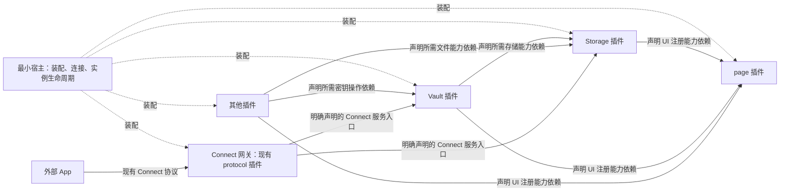

# Keymaster 扁平插件迁移需求（WebLoom 0.6.0）

状态：实施中。需求编写日期：2026-10-03；实际进展与未完成项见配套施工单及实施附表。

配套：[施工单](./Keymaster扁平插件迁移施工单.md)。框架依据：WebLoom 0.6.0 的公开导出、随包迁移指南及插件服务模型。原需求基线引用 0.5.0，当前代码已消费正式 0.6.0；依赖升级不等于产品迁移已完成。

## 1. 设计愿景与范围

**所有功能都是平等的插件。插件拥有服务及自己的 UI，其他插件通过声明的能力使用服务。宿主只负责装配；page 插件负责网页布局、注册入口和挂载。**

“扁平”表示没有 core、platform、business 的等级体系，不表示没有依赖。实际依赖是有向无环图，可以有共享提供者，不强制整理成一棵单父树。

本次迁移覆盖现有发行版的全部插件、Window/Worker 适配、界面挂载、系统聚合工作区及 Connect 网关。保持单 Key、本机 IndexedDB、已有钱包流程和领域业务语义。删除用户插件启停体系；不以重命名旧开关代替删除。

本次不新增链上数据提供者体系、不扩展 Connect 方法族、不修改 KeyHold 密码学格式、不重新设计交易/支付、不恢复 S3/多 Key，也不要求一个函数对应一个 Worker。保留其他未完成提案的原有范围，不借此次迁移顺便扩展功能。

## 2. 目标关系



实线表示消费方依赖提供方；虚线只是装配。注册 UI 不表示 page 取得贡献方全部服务。关系图只示意主要关系，真实依赖必须按运行单元、具体能力及来源声明。

```text
Storage 插件（pluginId = storage，插件的稳定身份）
  ├─ 对内公开 API：绑定消费插件身份的文件/K-V/快照能力
  ├─ Connect 公开 API：绑定已验证 App 会话的受限存储能力
  ├─ 私有 API：全局只读浏览、内部管理与状态投影
  ├─ Web 单元：代理、页面、设置、读写指示灯
  └─ Worker 单元：唯一存储引擎、文件操作、事务和最终存储授权

Vault 插件（pluginId = vault）
  ├─ 对内公开 API：受控密钥操作、明确公开的身份/会话视图
  ├─ Connect 公开 API：现有允许对外的身份/密码学操作
  ├─ 私有 API：自己的密钥管理和解锁流程
  ├─ Web 单元：代理、自己的 UI
  └─ Worker 单元：私钥操作、密钥内存与相应会话权威

page 插件（pluginId = page）
  ├─ 对内公开 API：页面、设置块、header 项等 UI 注册与挂载能力
  ├─ 私有 API：路由匹配、布局、注册表读取与渲染
  └─ Web 单元：网页外壳；没有 Worker 单元要求
```

unitId 是稳定运行单元标识，instanceId 是一次实际启动的实例标识。同插件的 Web 与 Worker 共用 pluginId，但各自有实例及作用域，不合并实例身份。

## 3. KM-R01 · 插件模型与源码边界

1. 删除 Keymaster 的 PluginKind（插件等级分类）以及根据分类产生的权限、排序启动和包依赖规则。产品导航可以保留主题/业务分组，不得继续使用 core/platform/business 暗示权限等级。
2. 删除 startup（旧必需/可选启动分类）、defaultEnabled（默认启用意图）、canDisable（是否可停用）、desiredEnabled（用户启用意图）、desiredRevision（启停意图修订）及相关运行链路。插件管理页改为运行状态、依赖原因和恢复诊断；没有开关。
3. 发行版装配清单内所有插件都登记。缺依赖、锁定、网络中断或初始化失败可以使单元等待/失败；“全部参与系统”不代表所有业务永远可执行。
4. 使用框架 definePlugin（定义单元）、definePluginPackage（组织同身份插件包）及 implementationsForRuntime（选择当前执行环境实现），或保留一层等价的薄产品适配。不得另造一份身份、依赖与生命周期真值。
5. 运行单元是初始化/销毁单位，函数是调用单位。后台函数共享所属单元的引擎、缓存和清理；不为后台函数拆出新的业务插件身份。
6. packages/contracts 保留公开领域契约，不包含私有实现、私有授权材料和可执行 UI 闭包。packages/ui 保留普通展示组件；使用这些组件不等于绕过 page 挂载。packages/runtime 只保留产品适配和通用辅助，不继续拥有各插件业务服务与全局领域注册表。
7. 源码门禁按真实插件归属扫描，包括 platform-storage，不能只扫描 plugin-* 前缀。其他插件只能导入公开契约和允许的无服务共享工具，不能导入实现、单例、私有 Context 或 Worker handler。同插件内部导入正常允许。

插件包的统一定义不等于把所有实现导入所有 realm。分别提供 Web/Worker 装配入口，静态描述从同一份定义物化；不能仅在导入全部实现后过滤 runtime，就宣称 Web bundle 已排除 Worker 私有引擎。

## 4. KM-R02 · 先声明能力，才能使用

1. dependencies（能力依赖）按单元声明具体 typed capability（带类型、标识与版本的能力对象），并明确提供者/来源绑定。声明插件名字不等于获得它的全部服务。
2. setup、UI、资源加载器、后台任务统一通过所属实例的消费视图解析。使用 ctx.consumer（框架签发的实例视图）及 PluginConsumerProvider（将视图绑定到组件树）；不得给业务 UI 完整 Host/App。
3. 未声明能力的获取、可选查询、订阅和调用均拒绝。optionalCapability（查询已声明但可缺席的能力）不能用于免检；A 依赖 B、B 依赖 C，不允许 A 直接使用 C。
4. 不通过 ctx.storage、storageFor、filesFor 或 ctx.coordinator 的自动注入绕过服务依赖。存储用途声明仍描述目录和权限，但必须同时声明所需 Storage 能力。如保留便捷门面，其内部只能使用已验证依赖与受限身份。
5. 跨插件共享资源必须使用提供方公开的 reader/subscription（读取/订阅）能力。插件只能查阅自身资源定义，不按字符串资源编号读取其他插件的 loader，也不获得全局 ResourceStore。
6. 编译期负面检查与运行时拒绝同时验收。WebLoom 不沙箱化任意 JavaScript，因此产品 import 和导出门禁必须真实执行。

## 5. KM-R03 · 三个访问面

| 访问面 | 使用者 | 产品约束 |
| --- | --- | --- |
| 对内公开 API | 其他已装配插件 | 明确发布能力；消费单元声明依赖；领域身份与范围由提供方核对 |
| Connect 公开 API | 经网关验证的外部 App | 提供方明确发布方法及范围；网关声明依赖并绑定 App 会话；不自动导出全部内部服务 |
| 私有 API | 同插件自己的实现和自己的 UI | 本地闭包/私有 Context，跨 realm 使用框架私有 RPC/stream；不允许外部插件解析 |

local、rpc、stream 分别是同执行环境对象、异步请求、异步流的传输形态，与三个访问面不是同一分类。三个访问面不要求三个 Worker、三个插件或三套服务状态。

插件自己的 UI 可以使用本插件完整私有服务，不为页面、设置和指示灯逐一增加权限表；仍受所属实例有效期、钱包锁定和领域操作条件约束。自己的私有 UI 操作也不能直接绕过最终 I/O 检查。

私有跨单元服务使用 privateProvides（私有提供声明）、handlePrivate（登记私有处理函数）和 privateCapability（获取所属私有客户端）。可信装配层配置 privateCapabilities（允许消费单元与授权材料）；授权材料不进入公共服务目录、Connect、持久业务设置或 UI 注册数据。同一 pluginId 的字符串不是授权证明。

私有消费也必须明确提供单元和来源槽位。授权登记不代表提供者已就绪；同插件的实际初始化前置关系仍须接入依赖/运行条件，不能因共享 pluginId 或已经拿到代理而提前宣称服务可用。

消费实例与服务实例任一撤销，旧私有句柄失效、在途请求/流取消、迟到结果不发布；重建必须重新解析。Window/Worker 两端必须具备真实连接身份和消费单元实例快照，不能缺快照时降级放行。私有通道不另写票据/清理算法，复用 0.6.0 实现。

## 6. KM-R04 · page 是唯一正式 UI 挂载入口

1. 新增 page 插件，承接现有 apps/web/src/shell 中的网页外壳、路由匹配、导航、header、设置容器、通知等布局与挂载逻辑。apps/web 只保留启动、可信装配及启动前/不可恢复崩溃兜底，不继续渲染领域页面。
2. 插件必须声明 page 的对应注册能力，才能贡献页面、设置块、header 指示灯、菜单等条目。现有 UI 不允许通过 Shell 特判、全局路由单例或直接修改 DOM 插入页面。插件内部组件可以正常组合 React 子组件，不要求每个子组件都登记。
3. page 自己的渲染器和只读注册表留在 page 内部。公开注册 API 不暴露原始可执行条目集合、其他插件私有闭包或其他插件 consumer；如导航需要公开元数据，单独给出纯数据视图。
4. 每个可执行贡献条目携带贡献方真实 consumer 和自己的渲染闭包/私有 Context。挂载时使用贡献方 consumer，不能使用 page、settings、home 或 App 的全局身份。嵌套贡献分别绑定自己的身份。
5. 使用框架 createScopedRegistryView（实例作用域注册门面）约束注册、更新、注销与清理；归属由 scope（框架作用域）写入，不信任自填 owner。不能通过重复条目编号接管其他存活实例；旧清理不能注销同名新实例条目。
6. page 可定义产品注册契约及挂载适配，但不能只把旧全局 registry 包一层并继续交给所有插件。条目 consumer 的真实性、所属实例与注册归属必须核对；撤销后立即撤下 UI，晚到的异步注册不复活。
7. page 的基础布局/注册能力不硬依赖 Storage、Vault、settings 或业务插件。贡献方依赖 page，page 消费已经注册的内容；不得为显示 Storage 指示灯再声明 page → Storage → page 的环。主题等已有设置通过不形成回边的显式只读视图或配置输入应用。
8. 初始化、锁定、解锁、协议弹窗也经 page 挂载：Vault/Storage/protocol 提供自己的内容；page 不直接导入它们。除最小启动/崩溃兜底外，不保留绕行页面清单。

## 7. KM-R05 · Storage 的完整归属

1. 保留 storage 身份；现有 packages/platform-storage 可先保留目录名，不能因改名造成业务路径变化。对外不再称其为权限等级较高的 platform 插件。
2. Worker 单元拥有 IndexedDB 引擎、文件/K-V/快照适配、事务、授权与实际提交；Web 单元拥有代理、只读浏览页、已有设置/状态入口及读写指示灯。三类 UI 同属一个 Web 单元即可。
3. 对内文件能力按受信任消费身份绑定命名空间。概念上 savefile(plugin, path, data) 对应 /plugin-name/path，但实际客户端不接受调用者任意自报 plugin；提供方从有效实例/授权绑定身份。保留 module/purpose（模块/用途）现有目录声明和共享授权，不强制将旧模块目录重命名为包名。
4. Connect 文件能力绑定已验证 App 的稳定存储身份，逻辑根为 /apps/app-name/path。显示名称不作为身份；App 不能指定其他 App、插件目录、保留区或路径穿越。内部和外部复用同一引擎及事务规则。
5. 全钱包只读浏览属于 Storage 自己的私有 UI 能力。page、其他插件和外部 App 都不能取得全局列举/读取 API；不再把 STORAGE_BROWSE_SERVICE_CAPABILITY 作为其他插件可以声明的公共服务。私有内部契约可以存在于 Storage 自己的模块中。
6. 浏览范围、锁定清空、分页、预览上界和禁止展示秘密等既有约束保持。迁移不增加全局写入浏览器，不补做存储浏览器提案中未验收的新功能。
7. 只向其他插件公开它们确需的受限状态/操作；自己的页面、设置、指示灯共享私有状态投影。指示灯使用有界活动状态，不记录敏感文件内容。
8. 保持现有 IndexedDB schema、KeyHold、逻辑目录和恢复文件可读。不以“升级架构”为由清空钱包；删除的仅是插件启停专用设置，不删除业务配置、App 授权或恢复证据。

## 8. KM-R06 · Vault 的完整归属

1. 保留 vault 身份，Web 单元拥有自己的创建/导入、解锁、密钥管理及自动锁定 UI；Worker 单元拥有密码学操作、明文私钥与相关会话权威。页面不读取私钥字节。
2. Vault 通过声明的 Storage 能力访问必要密文/元数据，不直接打开数据库，也不获得其他插件根目录。钱包创建/重置等已有管理流程通过专用受限操作协作，不把全局根存储公开给 Vault 普通文件客户端。
3. Storage 底层引擎只承担存储密文和数据，不因启动引擎而要求 Vault 已解锁。Vault 可以依赖 Storage 的底层存储服务；不得同时产生 Storage 引擎 → Vault → Storage 引擎的初始化环。
4. 原 WalletLifecycleService 等混合代码按实际职责拆分：密钥/密码学由 Vault 拥有，持久化事务由 Storage 拥有，跨步骤原子性与故障恢复保持；不能机械移动文件后让 page 或宿主继续持有领域服务。
5. 自己的管理 UI 通过私有代理执行管理操作；业务插件只获得明确公开的操作式能力；Connect 只获得已有对外方法。不得因同 Worker/内置插件而开放私钥或免去确认。
6. 会话视图、锁定通知和钱包世代只有一份权威，各端是投影。既有超时锁定、请求撤销与最终签名检查保留，Worker 重启后不能恢复明文私钥或自动重放签名。

## 9. KM-R07 · 依赖与运行条件决定生命周期

1. 服务初始化并发布后，必需依赖者才能启动。禁止依赖清单顺序、bootstrapStage（旧启动阶段）、手写 priority 或“required 插件先启动”代替依赖图。
2. 初始化/锁定/解锁等是领域运行条件，不是启停意图。保留明确的业务流程与 scopeKind（钱包/会话等寿命类别），由权威运行条件接入框架；不能另存一份运行单元 ready 布尔值伪装依赖就绪。
3. 计划销毁按消费者先、提供者后执行并等待清理；共享提供者不会因一个消费者销毁而销毁。已绑定可选依赖参与相应顺序，未绑定可选依赖不阻塞独立功能。
4. 锁定/重置先撤销旧授权与 UI，再等待清理；意外断线立即拒绝失效路径。cleanup-pending（清理尚未完成）不得标成已完成，不提前释放执行名额或允许同名实例越过资源围栏。
5. 可信装配层使用 revoke（撤销实例）/retry（重建实例）及框架运行条件适配，不能把它们包装成用户持久化 enable/disable。状态显示采用框架当前枚举与原因，不维持旧状态翻译双轨。
6. createWindowApp/startSharedWorkerApp 返回不表示所有领域服务可用。应用从明确需要的能力和单元状态判定就绪；结构错误拒绝装配，业务失败有诊断/恢复界面，不让无关失败堵住全部页面。
7. 不自动重放签名、广播、支付、上传或保存。重建的是服务实例与合法注册，结果未知的请求按既有恢复记录处理。

## 10. KM-R08 · Worker 部署与最小宿主

1. 默认保持现有共享 Coordinator SharedWorker 部署，Storage/Vault 等各有自己单元与代码归属。Coordinator 入口收缩为装配、连接与运行条件接线，领域 handler/引擎迁回所属插件。共享物理 Worker 不等于共享插件权限。
2. runtimeSlotBindings（运行单元/能力到逻辑槽位的绑定）由可信装配维护，使用 0.6.0 多桥能力。Worker URL/name 是部署事实，插件实现不写死。新增槽位不能替换已有槽位，解析与就绪检查使用同一绑定。
3. 本次不强制生产环境把 Storage/Vault 拆成两个物理 Worker。必须验证产品多槽位接入能同时连接两个真实 Worker；默认钱包部署和多槽位装配分别验收。任何后续分离部署必须另验证其实际跨 Worker 依赖、唯一存储写入权威和会话权威，不能只改 URL 就宣称隔离完成。
4. 单槽位断开只失效相关路径；旧连接迟到卸载不影响替换连接。两页面共享 Worker 时，关闭一页只清理该页连接、UI 与消费授权，不销毁另一页仍使用的提供者。
5. 现有 authority lock（防止新旧构建同时成为钱包权威的锁）、最终 I/O 租约、世代/CAS、取消和不可逆操作审计继续生效。框架槽位与实例标识不替代产品的权威锁。
6. 宿主可以持有完整 Host/App 用于可信装配和诊断，不注入业务组件。统一运行条件适配不继续承担存储、密钥、资产和 Connect 方法实现。

## 11. KM-R09 · 其他插件与系统工作区

1. 现有发行版所有插件逐一迁移，不能只展示 Storage/Vault demo 后宣布完成。每个插件明确提供能力、必需/可选依赖、三个访问面、单元寿命及 UI 归属。
2. home、settings、message 等与其他插件同等地位。settings 负责自己的设置/诊断业务，page 负责布局与挂载；不继续存在“core 可访问全局”的特例。
3. apps/web/src/system/registerAssetWorkspace 的资产、藏品及链设置等聚合 UI 归入明确的 workspace 插件（packages/plugin-workspace），通过服务/领域注册能力消费现有提供方，并通过 page 注册。根据用户确认，普通 BSV 转账 /transfer 归 P2PKH 插件，由该实例持有收款校验、输入、预览与转账 UI；藏品转移仍按独立领域 handler 组合。不留宿主直接注册资源与页面的隐藏插件。
4. Asset/Token/Importer/Transfer 等领域注册表归相应提供服务的插件，不全部塞进 page。page 只负责 UI 入口，领域注册/读取同样声明能力与实例归属。
5. WOC、P2PKH、MSFile、SatSubscription、P2P、后台任务等调用服务而不是互导实现；公共工具抽到无服务共享模块，不能用 import 白名单继续放行私有 handler。
6. 配置保留主题、语言、价格/供应商/网络等业务含义；删除启停专用字段与 Worker 固定不可停用目录。插件存在于发行版不代表自动进行付费、联网或交易；执行继续满足既有业务配置和授权条件。

## 12. KM-R10 · Connect 只连接显式对外服务

1. 现有 protocol 插件作为 Connect 网关拥有协议、App 会话/验证、方法分派与确认 UI；不强制把 SDK 或 apps 启动器改名为网关。packages/connect 仍是外部 SDK。
2. 服务提供方声明 Connect 方法与范围，网关声明消费相应对外契约。内部服务目录不自动变成 Connect 发布名单，私有 API 永远不进入名单。
3. 网关转发时绑定 App 身份、会话、origin（来源）、Owner（钱包身份）及授权范围。Storage 不能把网关自身 pluginId 当成 App 目录身份，也不能相信请求自报 appName。
4. 保留 Connect V1、已有 SDK 方法/错误码、用户确认与 App 身份证明。内部能力重构不得无意改变外部语义；没有对外发布的方法明确拒绝。
5. 协议弹窗也通过 page 注册/挂载，使用 protocol 的 consumer；弹窗刷新/退出和外部会话撤销沿用现有语义，不借完整 Host 查询其他插件私有服务。

## 13. 完成判据与文档关系

全部 KM-R01–R10 必须有对应施工项与产品验收。框架测试通过、编译通过、目录改名、模拟 demo 或测试用 consumer 不能替代真实产品证据。

验收至少包括：未声明依赖在 setup/UI/资源/Worker 被拒；page 三类贡献归属及撤销；Storage/App 路径隔离和私有全局浏览拒绝；Vault 无密钥泄露；依赖启动/反向清理；旧句柄与在途 RPC/stream；两页共享 Worker；多槽位连接；持久数据兼容；既有钱包和 Connect 流程。

类型、单元/transport、构建产物、真实浏览器和外部 Connect 分层记录；未执行的层级明确未完成。测试证据按项目规则维护在 docs/集成测试/覆盖矩阵.yaml，不在本文提前填写“已通过”。

本需求在实施范围内取代旧文档中分类、启停、全局 Context 和宿主直接挂载的目标；其余存储格式、业务恢复、最终 I/O 与 Connect 契约继续有效。实施完成后将稳定结论合并回 docs/架构.md、docs/插件生命周期.md、docs/存储.md、docs/Connect.md。迁移完成前，这些主题文档仍描述旧实现，不得混写为已完成。
